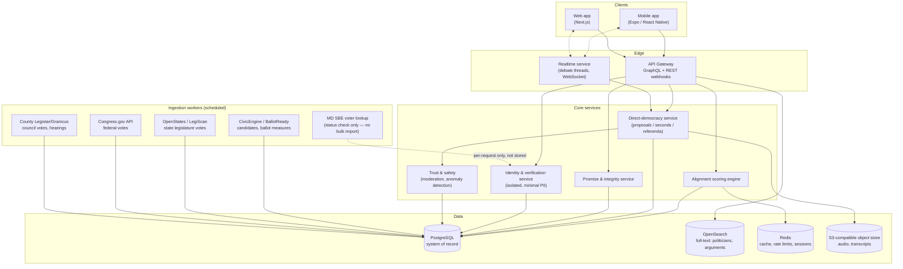
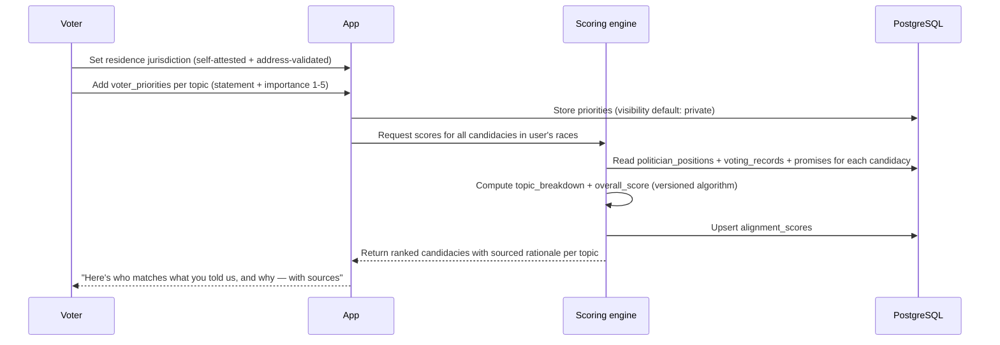
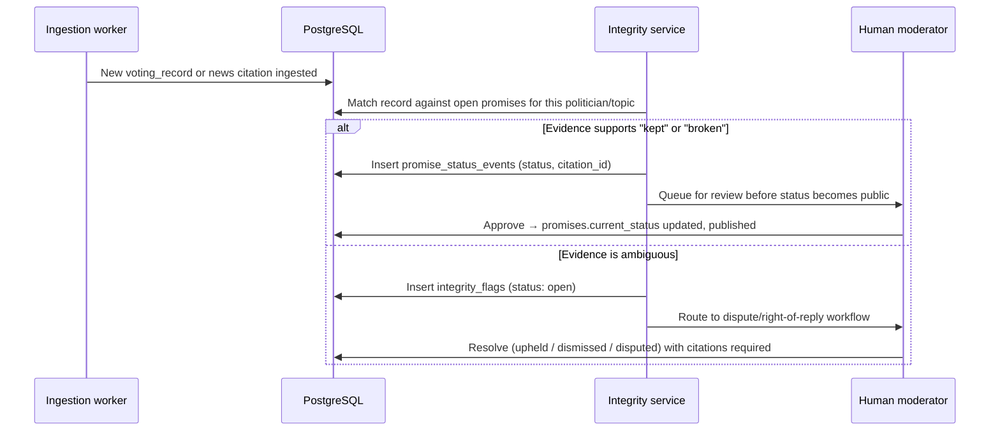
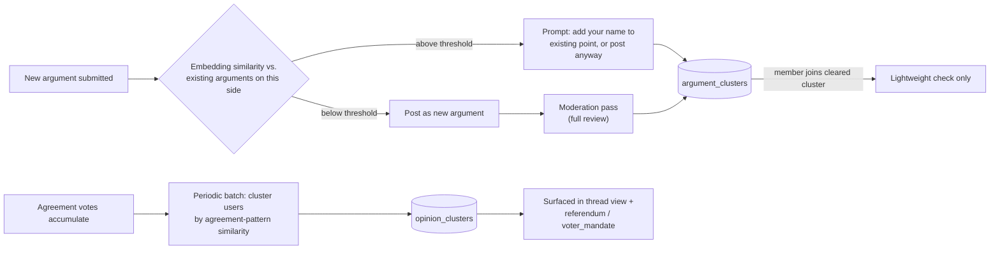
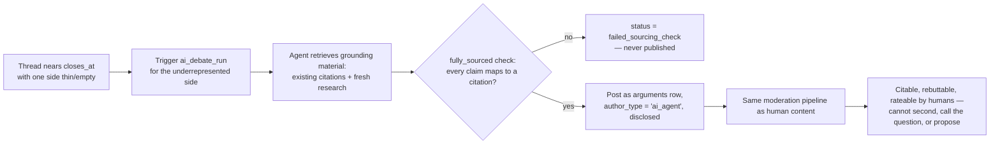

# VoteRight — Architecture & Domain Model

Status: draft v0.2 — pre-legal-review
Scope: Montgomery County, MD pilot, designed to generalize to any U.S. jurisdiction

---

## 1. What this document is

VoteRight is a civic platform that does four things:

1. **Captures what voters want** — their stated priorities and objectives on issues, not just party ID.
2. **Scores politicians and candidates against those wants** — using sourced, citable platform positions and actual voting/legislative records.
3. **Tracks promises to completion** — kept, broken, in-progress, compromised — with an evidence trail.
4. **Runs a direct-democracy layer on top of representative democracy** — voters raise issues, second them, debate them (text + audio), and vote on them in unofficial referenda whose results are published as a public "mandate" overlaid on officeholders' scorecards.

The premise behind all four: elections are too often won on name recognition rather than fit. A candidate can know in advance they won't vote for what their voters actually want, or conceal a thin record until safely in office — and nothing in the voter's information environment surfaces that before the vote or holds it against them after. VoteRight's answer is a loop, not a scoreboard: voters state what they want → candidates are measured against it before the election → published mandates are put to every candidate for the office, on the record (`mandate_commitments`, Section 7.9) → a winner's commitments become tracked promises → and when promises are ignored or broken, the voter is routed to the real, jurisdiction-verified corrective levers that actually exist (Section 2, `accountability_pathways`) rather than to imaginary ones.

This document defines the domain model, the relational schema, the system architecture, the key workflows, and — because this product touches election law, defamation risk, and constitutional limits on removing elected officials — the guardrails that have to be true before any of it ships.

**Read Section 2 before reading anything else.** Several things in the original product brief (recall, "prohibiting a politician from becoming elected") are not legally available as literal features in Maryland, or anywhere in the U.S. at the federal level. The architecture below reframes them into something real, honest, and still useful.

---

## 2. Legal & constitutional guardrails (read first)

These are facts, verified against current sources, not design opinions. They constrain the schema in Section 5 directly (see `accountability_pathways`).

### 2.1 There is no petition-based recall in Maryland, at any level relevant to this app

- Maryland does **not** provide for recall of state officials. State officials are removed only by impeachment (Governor, Lt. Governor, judges — and the constitution is silent on legislators) or automatic removal upon criminal conviction.
- **Montgomery County has no recall provision** for the County Executive or County Council. The County's own 2022 Charter Review Commission explicitly considered adding one and **voted against it**. This is consistent across all Maryland charter counties (Montgomery, Anne Arundel, Frederick, Prince George's, Baltimore) — none has recall.
- The only way to remove a sitting Councilmember before their term ends is a **7-of-11 supermajority Council vote** (Charter §118) — after a public hearing, only on a finding of physical or mental disability preventing them from serving, and appealable de novo to the Circuit Court — not for policy disagreement or broken promises. (The Council has been 11 members — 4 at-large, 7 district — since December 2022, when the 2020 voter-approved charter amendment took effect; the older 9-member / 6-vote figures still circulate and are wrong.) Conviction of certain crimes triggers removal under the state constitution.
- **There is no recall mechanism for federal officials** (House, Senate) anywhere in the U.S. — it doesn't exist under the Constitution, full stop.

**Consequence for the product:** a feature literally called "recall" that voters can trigger is not just unbuilt, it is describing a legal power that does not exist. Shipping it as described would be functionally spreading civic misinformation. Section 5 replaces it with `accountability_pathways` — a jurisdiction-and-office-aware table that tells a voter, truthfully, what *is* available for a given seat (next-election defeat, primary-challenger support, the narrow disability-removal vote, criminal referral, or — honestly — "no removal mechanism exists before the next election"). The word "recall" should not appear in the shipped product's UI unless a specific office actually has one (some municipalities, via city charter, do — this must be checked per office, not assumed).

### 2.1.1 Debating the absence of recall is not the same problem as pretending recall exists — and there's a real, binding lever underneath it

Everything in 2.1 is about not *misrepresenting* a legal power. It says nothing about whether voters can *advocate for creating one* — they plainly can. A debate on "should Montgomery County adopt recall?" is core political speech about a law-reform question, not a factual claim about a named person, so it doesn't carry the defamation/misinformation exposure that Section 2.3's integrity scoring does. It belongs in `issue_proposals` like any other topic.

It's better than that, in fact: Montgomery County has a real, binding, **voter-initiated charter amendment petition** process (Md. Constitution Art. XI-A, §5; Local Government Article). The rule is 20% of registered voters, "provided that in any case 10,000 signatures shall be sufficient" — meaning 10,000 is a *ceiling* that satisfies the requirement in a county this size, not an additional floor on top of 20% (20% of Montgomery County's ~680,000+ registered voters would be well over 100,000; the proviso is what actually governs). This isn't theoretical — it's been used repeatedly: a unanimous-override requirement for property tax increases (2008), term limits for County Executive and Council (2016), and a further term-limit reduction that qualified in 2024 with 15,956 certified signatures — comfortably above the 10,000-signature bar and nowhere near 20%, which confirms which figure actually governs. Adding a recall provision to the County Charter is exactly the kind of thing this mechanism exists for.

Two things follow for the schema:

- `accountability_pathways.mechanism_type` gets a `charter_amendment_petition` value — a genuinely **binding** pathway, unlike most of the others in that table.
- `accountability_campaigns` needs to represent a campaign whose target is a *law or charter change*, not a *politician* — see the polymorphic redesign in Section 5.

And two hard limits, so the feature doesn't overstate what the app itself can do:

1. **In-app support is not a legal signature.** `accountability_campaigns.support_count` measures in-app backing; `external_petition_status` separately tracks the real petition's progress through the Board of Elections. The app can organize and mobilize toward a real signature drive — it cannot substitute for one. Actual petition signatures have their own legal form, circulator, and verification requirements.
2. **Spending money to organize a signature drive can itself trigger campaign-finance registration questions** — added to Section 13.

### 2.2 The app cannot "prohibit" a politician from receiving votes or being elected

Elections are administered by the state; no third-party app has or can have a gate on ballot access or vote counting. What the product *can* legitimately do:

- Publish, before an election, a sourced alignment score and an integrity/promise-fidelity record for every candidate, prominently and early enough to influence the vote.
- Make that information easy to act on (share, save, bring to the polls) — same lane BallotReady and VOTE411 already occupy.
- After the election, keep scoring the officeholder against what they said, and route users toward the real levers in 2.1 when a mismatch appears.

"Guardrails prohibiting a politician from receiving the vote" gets implemented as **maximally visible, well-timed, evidence-linked disclosure** — not as a technical gate, because no such gate can exist.

### 2.3 Integrity/"deception" scoring is a defamation and misinformation risk if done carelessly

Calling a specific named politician a "liar" or "deceiver" is a factual assertion about a real person that can be legally actionable if wrong, and reputationally significant even in an "unofficial" app. Mitigation, built into the schema:

- Every `integrity_flag` and every `promise` status change must carry `citations` — sourced, dated, archived (Wayback-style) evidence — never a bare community vote.
- A published, versioned scoring methodology (`algorithm_version` on `alignment_scores`), so a score is reproducible and appealable, not a black box.
- A mandatory **dispute / right-of-reply workflow** before a negative flag is marked "upheld" and shown at full visibility — modeled on how PolitiFact/Ballotpedia structure fact-checks, not how social media ratios work.
- Clear separation, in the UI and the data model, between **sourced fact** (a recorded vote, a dated quote) and **community opinion** (an argument in the debate forum). These must never share a visual weight.

### 2.4 The unofficial referendum must never be mistaken for an official one

An "unofficial referendum" run inside an app, if it looks and feels like a ballot, is exactly the kind of thing that causes voter confusion about what's binding. Every referendum-related surface (`referenda`, `voter_mandates`) must carry a non-removable, prominent disclosure that the result is advisory and has no legal force. This is a product requirement, not a legal footnote — treat it the way BallotReady treats "this is not the official ballot."

### 2.5 Sybil resistance is an existential requirement, not a nice-to-have

A tool explicitly designed to (a) aggregate "the people's" position on an issue and (b) apply organized pressure to a named elected official is a **direct, obvious target** for coordinated manipulation — partisan brigading, and plausibly foreign influence operations, exactly the pattern seen against other civic-tech platforms. `referendum_ballot_tokens` and `seconds` are one-per-verified-person, weighted by `verification_tier`, with anomaly detection on the ingestion pipeline (Section 9). This is not optional hardening to add later; it is why the `verification_tier` enum exists in `users` from day one.

### 2.6 Never ingest Maryland's purchased voter registration file into this product

Maryland will sell a statewide or county voter list, but the buyer must sign a statement, under penalty of perjury, that it will be used **only** for activities that meet the legal definition of "electoral process" — not general product use. Misuse is a criminal misdemeanor. VoteRight's `users.residence_jurisdiction_id` is **self-attested + address-format-verified** (e.g., via a geocoding/address-validation vendor), never matched against an imported copy of the state voter file. If registration-status *verification* is ever needed, call the state's own public lookup (`voterservices.elections.maryland.gov/votersearch`) at request time and discard the result — don't warehouse it.

### 2.7 Campaign-finance / "electioneering" classification is an open question, not a default

A platform that scores candidates and can be used to organize pressure toward a specific outcome may register as issue advocacy or express advocacy under FEC/state law depending on funding, timing, and paid promotion, and the choice of nonprofit form (501(c)(3) vs. (c)(4) vs. none) changes what's allowed. This has to be decided with counsel before the org takes outside money or promotes content close to an election — flagged again in Section 13.

---

## 3. Domain model — glossary

| Concept | What it is |
|---|---|
| **Jurisdiction** | A governed geography (country → state → county → municipal → school district), keyed by [OCD-ID](https://github.com/opencivicdata/ocd-division-ids) so it interoperates with BallotReady/Ballotpedia/OpenStates data rather than inventing new geography IDs. |
| **Office** | A specific elected seat — or multi-seat pool — within a jurisdiction (e.g., "Montgomery County Council, District 1"; the Council's four at-large seats are one office row with `seat_count = 4`). |
| **Office term** | One politician's tenure in one office — start, end, elected vs. appointed. The standing officeholding record behind incumbency and the your-ballot view: `race_incumbents` is per-contest, `office_terms` is per-seat. |
| **Election cycle / Race** | A dated election event; a race binds an office to a cycle. |
| **Politician** | A person who has ever held or run for office — persists across multiple candidacies/terms. |
| **Candidacy** | One politician's run for one race. |
| **Topic** | A node in a hierarchical issue taxonomy (e.g., Housing → Zoning Reform). |
| **Voter priority** | A voter's own stated wish/objective on a topic, weighted by importance to them — the input side of matching. |
| **Politician position** | A sourced, citable platform plank on a topic. |
| **Promise** | A specific, checkable commitment tied to a topic, with a status that evolves as evidence arrives. |
| **Voting record** | An actual recorded legislative vote, ingested from an authoritative feed, not self-reported. |
| **Alignment score** | Computed fit between one voter's priorities and one candidacy/politician, topic-by-topic and overall. |
| **Integrity flag** | A sourced allegation that a politician's record contradicts a stated position or promise — disputable, appealable. |
| **Accountability pathway** | The jurisdiction-real mechanisms available to respond to a mismatch (see 2.1) — replaces "recall." Includes both officeholder mechanisms (next-election defeat, disability-removal vote, etc.) and, where real, a binding charter-amendment petition (2.1.1). |
| **Accountability campaign** | An instance of a voter organizing around a pathway — either targeting a specific politician, or targeting a law/charter change (e.g. petitioning to add a recall provision that doesn't currently exist). |
| **Issue proposal** | A voter-raised issue awaiting seconds. |
| **Second** | One voter's co-sponsorship of a proposal. |
| **Forum thread / Argument** | The structured, sourced, for/against debate space a proposal graduates into once seconded. Arguments may be text, audio, locally recorded/uploaded video, or a linked YouTube video. |
| **Referendum** | The unofficial, advisory ballot question a debated proposal can graduate into. |
| **Ballot token / ballot** | The two halves of a referendum vote, deliberately kept in separate tables: a token proves one verified person voted once; a ballot records the choice against the token, never against the person (Section 10.1). |
| **Voter mandate** | The published, public artifact summarizing a referendum's result — gated on a minimum-turnout threshold, not published automatically just because a referendum closed (Section 5, Section 10.1). |
| **Mandate commitment** | A candidate's public, sourced position (commit / decline / no response) on each standing voter mandate for the office they seek, recorded before the election; a committed winner's mandate becomes a tracked promise (Section 7.9). |
| **Argument cluster** | A group of near-duplicate arguments on the same side of a thread, reduced to one representative point — how a popular thread stays readable instead of a flat, repetitive feed. |
| **Opinion cluster** | A "camp" of users who tend to agree/disagree on the same statements within a thread, computed from agreement votes rather than from who posted what — surfaces real fault lines and bridging points beyond a binary for/against split. |
| **Amendment** | A revision to a proposal, itself requiring its own seconds before adoption — borrowed from Robert's Rules; the original proposal text is never overwritten (Section 7.6). |
| **Call the question** | A supermajority vote by a thread's active participants to close debate early rather than wait out the scheduled window — borrowed from Robert's Rules' "previous question" (Section 7.6). |
| **Independent expenditure** | A sourced record of outside/Super PAC spending for or against a candidacy or ballot measure, drawn from official campaign-finance filings (Section 8.1). |
| **Campaign communication** | A specific mailer, flyer, robocall, or ad that a user can check against a sourced finding of whether it's an actual official ballot — not a general "is this candidate honest" judgment (Section 8.1). |
| **Endorsement** | A sourced record of an organization (union, trade group, editorial board, etc.) backing a candidacy — always citation-required, never a bare claim (Section 8.1). |
| **Claim flag** | A prompt, at argument submission time, that a specific sentence reads as an unsourced factual assertion and could use a citation — deliberately not a judgment that the argument is "too opinionated" (Section 7.7). |
| **AI debate run** | A one-shot, evidence-grounded argument generated for whichever side of a debate is thin, triggered only by imbalance, always disclosed as machine-authored — never a running AI-vs-AI debate loop (Section 7.8). |
| **Commentator** | A local journalist or analyst whose commentary is surfaced by objective, disclosed rule (sustained beat coverage, real byline, disclosed affiliations) — never a staff editorial pick (Section 8.2). |
| **Commentary link** | A specific piece of expert commentary linked to a topic, politician, race, or issue proposal — attributed opinion, kept structurally separate from the `citations` evidence ledger (Section 8.2). |

---

## 4. Entity-relationship diagram

```mermaid
erDiagram
    JURISDICTIONS ||--o{ OFFICES : contains
    JURISDICTIONS ||--o{ JURISDICTIONS : "parent of"
    OFFICES ||--o{ RACES : "contested in"
    OFFICES ||--o{ OFFICE_TERMS : "held as"
    POLITICIANS ||--o{ OFFICE_TERMS : serves
    CITATIONS ||--o{ OFFICE_TERMS : evidences
    ELECTION_CYCLES ||--o{ RACES : schedules
    RACES ||--o{ CANDIDACIES : has
    RACES ||--o{ RACE_INCUMBENTS : "has sitting"
    POLITICIANS ||--o{ RACE_INCUMBENTS : "is incumbent in"
    POLITICIANS ||--o{ CANDIDACIES : runs
    POLITICIANS ||--o{ POLITICIAN_POSITIONS : states
    POLITICIANS ||--o{ PROMISES : makes
    POLITICIANS ||--o{ VOTING_RECORDS : casts
    POLITICIANS ||--o{ INTEGRITY_FLAGS : "flagged on"
    TOPICS ||--o{ TOPICS : "parent of"
    TOPICS ||--o{ VOTER_PRIORITIES : categorizes
    TOPICS ||--o{ POLITICIAN_POSITIONS : categorizes
    TOPICS ||--o{ PROMISES : categorizes
    USERS ||--o{ VOTER_PRIORITIES : states
    USERS ||--o{ ALIGNMENT_SCORES : receives
    CANDIDACIES ||--o{ ALIGNMENT_SCORES : scored
    CITATIONS ||--o{ PROMISES : evidences
    CITATIONS ||--o{ INTEGRITY_FLAGS : evidences
    CITATIONS ||--o{ ARGUMENTS : evidences
    PROMISES ||--o{ PROMISE_STATUS_EVENTS : has
    INTEGRITY_FLAGS ||--o{ INTEGRITY_FLAG_STATUS_EVENTS : has
    JURISDICTIONS ||--o{ ACCOUNTABILITY_PATHWAYS : "defined for"
    OFFICES ||--o{ ACCOUNTABILITY_PATHWAYS : "scoped to (optional)"
    ACCOUNTABILITY_PATHWAYS ||--o{ ACCOUNTABILITY_CAMPAIGNS : instantiated_as
    POLITICIANS ||--o{ ACCOUNTABILITY_CAMPAIGNS : "targets (if politician)"
    REFERENDA ||--o{ ACCOUNTABILITY_CAMPAIGNS : "may originate"
    USERS ||--o{ ISSUE_PROPOSALS : raises
    JURISDICTIONS ||--o{ ISSUE_PROPOSALS : scoped_to
    ISSUE_PROPOSALS ||--o{ SECONDS : receives
    USERS ||--o{ SECONDS : gives
    ISSUE_PROPOSALS ||--o{ PROPOSAL_AMENDMENTS : "may be amended by"
    PROPOSAL_AMENDMENTS ||--o{ AMENDMENT_SECONDS : receives
    USERS ||--o{ AMENDMENT_SECONDS : gives
    ISSUE_PROPOSALS ||--o| FORUM_THREADS : graduates_to
    FORUM_THREADS ||--o{ CALL_THE_QUESTION_VOTES : receives
    USERS ||--o{ CALL_THE_QUESTION_VOTES : casts
    FORUM_THREADS ||--o{ ARGUMENTS : contains
    USERS ||--o{ ARGUMENTS : posts
    ARGUMENTS ||--o{ ARGUMENTS : rebuts
    ARGUMENTS ||--o{ ARGUMENT_RATINGS : rated
    FORUM_THREADS ||--o{ ARGUMENT_CLUSTERS : groups
    ARGUMENT_CLUSTERS ||--o{ ARGUMENTS : "contains (near-duplicates)"
    ARGUMENTS ||--o{ ARGUMENT_AGREEMENT_VOTES : rated
    USERS ||--o{ ARGUMENT_AGREEMENT_VOTES : casts
    FORUM_THREADS ||--o{ OPINION_CLUSTERS : reveals
    ARGUMENTS ||--o{ ARGUMENT_CLAIM_FLAGS : prompts
    CITATIONS ||--o{ ARGUMENT_CLAIM_FLAGS : resolves
    FORUM_THREADS ||--o{ AI_DEBATE_RUNS : triggers
    AI_DEBATE_RUNS ||--o| ARGUMENTS : produces
    ISSUE_PROPOSALS ||--o| REFERENDA : graduates_to
    REFERENDA ||--o{ REFERENDUM_BALLOT_TOKENS : issues
    USERS ||--o{ REFERENDUM_BALLOT_TOKENS : "issued to (until redacted)"
    REFERENDUM_BALLOT_TOKENS ||--o| REFERENDUM_BALLOTS : redeems
    REFERENDA ||--o| VOTER_MANDATES : publishes_as
    OFFICES ||--o{ VOTER_MANDATES : "overlaid on"
    VOTER_MANDATES ||--o{ MANDATE_COMMITMENTS : "put to candidates as"
    CANDIDACIES ||--o{ MANDATE_COMMITMENTS : "answers with"
    CITATIONS ||--o{ MANDATE_COMMITMENTS : evidences
    MANDATE_COMMITMENTS ||--o| PROMISES : "becomes (commit + win)"
    USERS ||--o{ VERIFICATION_RECORDS : has
    INDEPENDENT_EXPENDITURE_COMMITTEES ||--o{ INDEPENDENT_EXPENDITURES : spends
    RACES ||--o{ INDEPENDENT_EXPENDITURES : "spent in"
    POLITICIANS ||--o{ INDEPENDENT_EXPENDITURES : "may benefit"
    CITATIONS ||--o{ INDEPENDENT_EXPENDITURES : evidences
    JURISDICTIONS ||--o{ CAMPAIGN_COMMUNICATIONS : scoped_to
    USERS ||--o{ CAMPAIGN_COMMUNICATIONS : submits
    CITATIONS ||--o{ CAMPAIGN_COMMUNICATIONS : evidences
    ENDORSING_ORGANIZATIONS ||--o{ ENDORSEMENTS : gives
    CANDIDACIES ||--o{ ENDORSEMENTS : receives
    CITATIONS ||--o{ ENDORSEMENTS : evidences
    JURISDICTIONS ||--o{ COMMENTATOR_INCLUSION_RULES : defines
    COMMENTATOR_INCLUSION_RULES ||--o{ COMMENTATOR_QUALIFICATIONS : evaluates
    COMMENTATORS ||--o{ COMMENTATOR_QUALIFICATIONS : "qualifies via"
    COMMENTATORS ||--o{ COMMENTARY_LINKS : writes
    POLITICIANS ||--o{ COMMENTARY_LINKS : "commentary about"
    ISSUE_PROPOSALS ||--o{ COMMENTARY_LINKS : "commentary about"
```



---

## 5. Relational schema (PostgreSQL)

Full DDL lives in [`SCHEMA.sql`](./SCHEMA.sql). Key design decisions called out here:

- **OCD-IDs for geography, Bioguide IDs for Congress members** — matches the CivicEngine/Ballotpedia/OpenStates ecosystem so VoteRight can ingest, not re-derive, geographic and person identifiers.
- **A single `citations` table** is the evidence ledger for the whole app — promises, integrity flags, and politician positions all point into it rather than each having its own free-text source field. One evidence pipeline, one place to check for link rot / archive coverage.
- **`verification_tier` is carried on every vote-weight-bearing row** (`referendum_ballot_tokens.verification_tier_at_issuance`, `seconds.verification_tier_at_second`), not just on `users`, so a later change to a user's verification status can't retroactively reinterpret a past vote's legitimacy.
- **Status history, not status columns, for promises and integrity flags** — `promise_status_events` and the dispute thread on `integrity_flags` preserve the evidence trail rather than overwriting it, since a defensible accountability record has to show its work over time.
- **`accountability_campaigns` is polymorphic over its target** — a campaign either targets a `politician_id` (accountability for a person) or a `reform_title` (a law/charter change, like petitioning to add recall). A `CHECK` constraint enforces that exactly one of the two is populated, rather than letting the two concepts blur into one nullable-everything row.
- **`arguments.format` extends to `video` and `youtube`**, each with its own required field enforced by `CHECK`, not left to application code — a debate post with no actual content in any format is a moderation gap, not just a UI bug.
- **Argument clustering and opinion mapping are separate mechanisms, not one feature** — `argument_clusters` groups near-duplicate *statements* (a text/similarity problem), while `opinion_clusters` groups *users* by their agreement pattern across statements (a voting-matrix problem, Pol.is-style). Conflating the two would lose the more useful signal: which specific points actually divide people versus which ones everyone already agrees on.
- **Amendments preserve the original proposal text rather than overwriting it** (`issue_proposals.current_amendment_id` points at whichever amendment is adopted) — same append-only instinct as `promise_status_events`: a debate record should always show what changed and from what, not just the latest version.
- **`close_early_threshold_pct` is a real column, not a hardcoded constant** — like `algorithm_version` elsewhere, a supermajority threshold that affects a real outcome needs to be disclosed and auditable, not buried in application code.
- **Outside money, ballot-authenticity checks, and endorsements are generalized platform capabilities, not seeded opinion** — `independent_expenditures`, `campaign_communications`, and `endorsements` all require a `citation_id` from an official filing or verifiable source, same as everything else in the evidence ledger. They generalize real feature gaps observed in local reporting patterns without importing any specific commentator's claims as platform-asserted fact (Section 8.1).
- **`argument_claim_flags` prompts for a citation on a specific unsourced claim, not for a "more objective" rewrite of the whole argument** — a debate needs opinions; the deliberate scope limit is what keeps this from becoming editorial tone-policing (Section 7.7).
- **AI-authored arguments share the same `arguments` table as human ones** (via `author_type` and a nullable `user_id`) rather than living in a parallel structure — they get the same citations, ratings, moderation, and rebuttal chain, so a human can rate, cite, or argue against an AI-generated point exactly like a human one. What's different is upstream: `ai_debate_runs.fully_sourced` is a hard, machine-checked gate before publish — a bar humans are deliberately never held to (Section 7.7 vs. 7.8).
- **`integrity_flags` gets the same append-only history as `promises`** (`integrity_flag_status_events`) — an earlier draft applied "status history, not status columns" inconsistently, and the single most defamation-exposed object in the schema is exactly the wrong place for that gap.
- **Referendum ballot secrecy is a real table split, not a disclaimer** — `referendum_ballot_tokens` (identity, for one-vote enforcement) and `referendum_ballots` (choice, with no `user_id` column at all) replace a single table that held both together forever. See Section 10.1 for the retention rule and the honest limits of this design.
- **`voter_mandates` cannot reach `overlay_status = 'published'` unless `meets_publish_threshold` is true** — enforced by a `CHECK`, not left to editorial judgment at publish time, so a low-turnout result can't accidentally get the same public presentation as a well-attended one.
- **`call_the_question_min_agreement_votes` closes a cheap-manipulation path** — a single one-click agreement vote was enough to count as an "active participant" eligible to help force early closure; it now takes several distinct agreement votes (or one posted argument) to qualify.
- **Multi-seat contests are modeled, not assumed away** — `offices.seat_count`, `races.seats_elected`, and a `race_incumbents` join table replace a singular incumbent column, because the pilot county itself elects 4 at-large Councilmembers from one countywide pool; a one-race-one-winner model breaks on 4 of the 11 seats it launches with.
- **`office_terms` is the standing officeholding record** — who holds each seat, from when to when, elected or appointed at entry (`offices.is_elected` marks office types that are appointed in some jurisdictions). `race_incumbents` answers "who is sitting in this specific contest"; `office_terms` answers "who represents this address right now," which is what the your-ballot view reads (Section 7.1). `politicians.current_office_id` stays as a denormalized convenience over the current-term row.
- **`mandate_commitments` closes the mandate → candidacy → promise loop** — a published mandate is put to every candidate in the next race for that office, on the record and citation-backed, before the election; a committed winner's mandate becomes a tracked `promises` row. This is the schema's direct answer to name-recognition politics: "will you carry out what the voters asked for?" gets asked, in public, while dodging it can still cost votes (Section 7.9).
- **Publish gates are constraints in three more places** — `integrity_flags` (`CHECK (NOT published OR status <> 'open')`), `campaign_communications` (no verified finding without a citation, no `is_official_ballot` verdict while unverified), and a trigger validating `referendum_ballots.choice` against the referendum's declared options — closing the gap between "gated by CHECK" (the stated principle) and "gated by comment" (what three tables actually had).
- **`accountability_pathways` is jurisdiction-scoped with an optional office** — the charter-amendment petition belongs to the county, not to any single office; forcing every pathway onto an office row would either duplicate it across every county office or pin it somewhere arbitrary.
- **Per-user agreement votes are held, used, then deleted** — they exist to compute `opinion_clusters` and the denormalized per-argument tallies (`agree_count` / `disagree_count` / `pass_count`), not to accumulate a permanent per-person political-opinion ledger. Section 10.2 classifies every participation act as deliberately public (arguments, seconds, proposals) or private-with-retention (agreement votes, call-the-question votes, referendum ballots).
- **Commentator inclusion is a computed fact, not a stored opinion** — `commentator_qualifications` re-evaluates against `commentator_inclusion_rules` the same way `alignment_scores` and `opinion_clusters` are recomputed, so nobody has to manually curate (or manually remove) a commentator as their publishing record changes. `commentary_links` never carries a `citation_id` role anywhere else in the schema — it is deliberately not part of the evidence ledger (Section 8.2).

```sql
-- ══════════════════════════════════════════════════════════════
-- GEOGRAPHY & OFFICES
-- ══════════════════════════════════════════════════════════════

CREATE TABLE jurisdictions (
    ocd_id          TEXT PRIMARY KEY,               -- e.g. 'ocd-division/country:us/state:md/county:montgomery'
    name            TEXT NOT NULL,
    level           TEXT NOT NULL CHECK (level IN ('country','state','county','municipal','school_district','special_district')),
    parent_ocd_id   TEXT REFERENCES jurisdictions(ocd_id),
    registered_voter_count INTEGER,                 -- refreshed periodically from official SBE stats
    registered_voter_count_as_of DATE               -- denominator for voter_mandates.turnout_pct_of_registered
);

CREATE TABLE offices (
    id              UUID PRIMARY KEY DEFAULT gen_random_uuid(),
    jurisdiction_id TEXT NOT NULL REFERENCES jurisdictions(ocd_id),
    title           TEXT NOT NULL,                  -- 'County Executive', 'Council District 1'
    seat_type       TEXT NOT NULL CHECK (seat_type IN ('single','at_large','district')),
    seat_count      SMALLINT NOT NULL DEFAULT 1,    -- >1 for multi-seat pools: Montgomery County Council elects 4 at-large members from one countywide contest
    term_length_years SMALLINT NOT NULL,
    is_partisan     BOOLEAN NOT NULL DEFAULT TRUE,
    is_elected      BOOLEAN NOT NULL DEFAULT TRUE,      -- some office types flip elected/appointed across jurisdictions (e.g. clerks); only elected seats get races
    level           TEXT NOT NULL CHECK (level IN ('federal','state','county','municipal','school_board','judicial'))
);

CREATE TABLE election_cycles (
    id              UUID PRIMARY KEY DEFAULT gen_random_uuid(),
    name            TEXT NOT NULL,                  -- '2026 Maryland Primary'
    election_date   DATE NOT NULL,
    election_type   TEXT NOT NULL CHECK (election_type IN ('primary','general','special','municipal')),
    commentary_promotion_blackout_days INTEGER NOT NULL DEFAULT 0,   -- see Section 8.2
    CHECK (commentary_promotion_blackout_days >= 0)
);

CREATE TABLE races (
    id                  UUID PRIMARY KEY DEFAULT gen_random_uuid(),
    election_cycle_id   UUID NOT NULL REFERENCES election_cycles(id),
    office_id           UUID NOT NULL REFERENCES offices(id),
    seats_elected       SMALLINT NOT NULL DEFAULT 1,    -- how many candidacies can end 'won': 4 for the at-large Council contest
    UNIQUE (election_cycle_id, office_id)
);

-- incumbency is a join table, not a singular column on races — a multi-seat at-large
-- contest (the pilot county's own Council) has several sitting incumbents at once
CREATE TABLE race_incumbents (
    race_id         UUID NOT NULL REFERENCES races(id),
    politician_id   UUID NOT NULL REFERENCES politicians(id),
    PRIMARY KEY (race_id, politician_id)
);

-- ══════════════════════════════════════════════════════════════
-- PEOPLE
-- ══════════════════════════════════════════════════════════════

CREATE TABLE politicians (
    id              UUID PRIMARY KEY DEFAULT gen_random_uuid(),
    full_name       TEXT NOT NULL,
    bioguide_id     TEXT,                           -- Congress members only
    external_ids    JSONB NOT NULL DEFAULT '{}',     -- { "ballotready_id": "...", "ocd_person_id": "..." }
    current_office_id UUID REFERENCES offices(id),  -- several politicians may share one office row (multi-seat at-large offices)
    party           TEXT,
    photo_url       TEXT,
    bio             TEXT,
    created_at      TIMESTAMPTZ NOT NULL DEFAULT now()
);

CREATE TABLE candidacies (
    id              UUID PRIMARY KEY DEFAULT gen_random_uuid(),
    politician_id   UUID NOT NULL REFERENCES politicians(id),
    race_id         UUID NOT NULL REFERENCES races(id),
    party           TEXT,
    status          TEXT NOT NULL DEFAULT 'active' CHECK (status IN ('active','withdrawn','won','lost')),
    website         TEXT,
    social_links    JSONB NOT NULL DEFAULT '{}',
    UNIQUE (politician_id, race_id)
);

-- ══════════════════════════════════════════════════════════════
-- ISSUES & VOTER INTENT
-- ══════════════════════════════════════════════════════════════

CREATE TABLE topics (
    id              UUID PRIMARY KEY DEFAULT gen_random_uuid(),
    name            TEXT NOT NULL,
    parent_id       UUID REFERENCES topics(id),
    description     TEXT,
    UNIQUE NULLS NOT DISTINCT (parent_id, name)     -- no duplicate topics at the same level, including top level (PostgreSQL 15+)
);

CREATE TABLE users (
    id                      UUID PRIMARY KEY DEFAULT gen_random_uuid(),
    auth_id                 TEXT NOT NULL UNIQUE,     -- external auth provider subject
    display_name            TEXT,
    email_hash              TEXT,                     -- hashed, not raw, if collected at all — pseudonymous, NOT anonymous: emails are dictionary-attackable (Section 10)
    residence_jurisdiction_id TEXT REFERENCES jurisdictions(ocd_id),  -- self-attested + address-format verified
    verification_tier      TEXT NOT NULL DEFAULT 'unverified'
                              CHECK (verification_tier IN ('unverified','email_verified','address_verified','govt_id_verified')),
    locale                  TEXT NOT NULL DEFAULT 'en',
    deleted_at              TIMESTAMPTZ,              -- MODPA deletion request: row is pseudonymized, not physically removed — see Section 10
    created_at              TIMESTAMPTZ NOT NULL DEFAULT now()
);

CREATE TABLE voter_priorities (
    id              UUID PRIMARY KEY DEFAULT gen_random_uuid(),
    user_id         UUID NOT NULL REFERENCES users(id),
    topic_id        UUID NOT NULL REFERENCES topics(id),
    statement       TEXT NOT NULL,                    -- the voter's own words: their wish/objective
    importance_weight SMALLINT NOT NULL CHECK (importance_weight BETWEEN 1 AND 5),
    stance          JSONB,                             -- optional structured position, e.g. { "direction": "support", "policy": "rent_stabilization" }
    visibility      TEXT NOT NULL DEFAULT 'private' CHECK (visibility IN ('private','anonymous_aggregate','public')),
    created_at      TIMESTAMPTZ NOT NULL DEFAULT now()
);

-- ══════════════════════════════════════════════════════════════
-- EVIDENCE LEDGER (shared by positions, promises, integrity flags)
-- ══════════════════════════════════════════════════════════════

-- One url may legitimately back several rows (different excerpts of the same page for
-- different claims), so there is deliberately no UNIQUE(url); dedup is an ingestion concern.
-- archive_url is nullable at ingest, but the publish workflows for integrity flags and
-- promise status changes require an archived copy before anything goes public (Section 2.3).
CREATE TABLE citations (
    id              UUID PRIMARY KEY DEFAULT gen_random_uuid(),
    url             TEXT NOT NULL,
    archive_url     TEXT,                             -- Wayback Machine snapshot, captured at ingestion time
    title           TEXT,
    publisher       TEXT,
    published_at    DATE,
    retrieved_at    TIMESTAMPTZ NOT NULL DEFAULT now(),
    excerpt         TEXT
);

-- OFFICEHOLDING — who holds a seat, from when to when. race_incumbents covers "sitting
-- incumbents in a specific contest"; this is the standing record behind it, and what the
-- "your ballot / your representatives" view reads. politicians.current_office_id is a
-- denormalized convenience over the row here with term_end IS NULL.
CREATE TABLE office_terms (
    id              UUID PRIMARY KEY DEFAULT gen_random_uuid(),
    office_id       UUID NOT NULL REFERENCES offices(id),
    politician_id   UUID NOT NULL REFERENCES politicians(id),
    term_start      DATE NOT NULL,
    term_end        DATE,                                 -- NULL = currently serving
    how_obtained    TEXT NOT NULL DEFAULT 'elected' CHECK (how_obtained IN ('elected','appointed','succeeded')),
    source_citation_id UUID REFERENCES citations(id),     -- swearing-in record / official roster
    UNIQUE (office_id, politician_id, term_start)
);

CREATE TABLE politician_positions (
    id              UUID PRIMARY KEY DEFAULT gen_random_uuid(),
    politician_id   UUID NOT NULL REFERENCES politicians(id),
    topic_id        UUID NOT NULL REFERENCES topics(id),
    statement       TEXT NOT NULL,
    source_type     TEXT NOT NULL CHECK (source_type IN ('campaign_site','questionnaire','debate_transcript','voting_record_inferred','interview')),
    citation_id     UUID REFERENCES citations(id),
    recorded_at     TIMESTAMPTZ NOT NULL DEFAULT now()
);

CREATE TABLE promises (
    id              UUID PRIMARY KEY DEFAULT gen_random_uuid(),
    politician_id   UUID NOT NULL REFERENCES politicians(id),
    topic_id        UUID NOT NULL REFERENCES topics(id),
    statement       TEXT NOT NULL,
    made_at         DATE,
    origin_citation_id UUID REFERENCES citations(id),
    current_status  TEXT NOT NULL DEFAULT 'pending'
                      CHECK (current_status IN ('pending','in_progress','kept','broken','compromised','stalled')),
    created_at      TIMESTAMPTZ NOT NULL DEFAULT now()
);

-- append-only history so a status is always explainable, never just overwritten
CREATE TABLE promise_status_events (
    id              UUID PRIMARY KEY DEFAULT gen_random_uuid(),
    promise_id      UUID NOT NULL REFERENCES promises(id),
    status          TEXT NOT NULL CHECK (status IN ('pending','in_progress','kept','broken','compromised','stalled')),
    citation_id     UUID REFERENCES citations(id),
    note            TEXT,
    recorded_at     TIMESTAMPTZ NOT NULL DEFAULT now()
);

CREATE TABLE voting_records (
    id              UUID PRIMARY KEY DEFAULT gen_random_uuid(),
    politician_id   UUID NOT NULL REFERENCES politicians(id),
    jurisdiction_id TEXT NOT NULL REFERENCES jurisdictions(ocd_id),
    bill_external_id TEXT NOT NULL,                   -- id in source system (OpenStates/LegiScan/Legistar/Congress.gov)
    bill_title      TEXT NOT NULL,
    vote            TEXT NOT NULL CHECK (vote IN ('yea','nay','abstain','absent')),
    voted_at        DATE NOT NULL,
    source_url      TEXT NOT NULL,
    ingested_at     TIMESTAMPTZ NOT NULL DEFAULT now(),
    UNIQUE (politician_id, bill_external_id)
);

-- ══════════════════════════════════════════════════════════════
-- TRANSPARENCY: OUTSIDE MONEY, BALLOT-AUTHENTICITY CHECKS & ENDORSEMENTS
-- See Section 8.1. Generalizes three feature gaps from local reporting
-- patterns into sourced platform capabilities fed by official filings —
-- never by any single commentator's specific claims.
-- ══════════════════════════════════════════════════════════════

CREATE TABLE independent_expenditure_committees (
    id              UUID PRIMARY KEY DEFAULT gen_random_uuid(),
    name            TEXT NOT NULL,
    committee_type  TEXT NOT NULL CHECK (committee_type IN
                      ('super_pac','slate_mailer_committee','ballot_issue_committee','party_committee','other')),
    registration_id TEXT,                        -- filer ID with the state/county board of elections
    external_ids    JSONB NOT NULL DEFAULT '{}'
);

CREATE TABLE independent_expenditures (
    id              UUID PRIMARY KEY DEFAULT gen_random_uuid(),
    committee_id    UUID NOT NULL REFERENCES independent_expenditure_committees(id),
    race_id         UUID REFERENCES races(id),
    benefits_politician_id UUID REFERENCES politicians(id),   -- nullable: may target a ballot measure instead
    direction       TEXT NOT NULL CHECK (direction IN ('supporting','opposing')),
    amount_usd      NUMERIC(12,2) NOT NULL,
    expenditure_date DATE NOT NULL,
    purpose         TEXT,                         -- e.g. 'digital ads', 'mailers'
    citation_id     UUID NOT NULL REFERENCES citations(id),   -- the filing itself; never bare assertion
    ingested_at     TIMESTAMPTZ NOT NULL DEFAULT now()
);

-- lets a user check a suspicious mailer/robocall/flyer against a sourced finding of
-- whether it's an actual official ballot — generalizes the "styled like an official
-- sample ballot" problem rather than reacting to one specific mailer
CREATE TABLE campaign_communications (
    id              UUID PRIMARY KEY DEFAULT gen_random_uuid(),
    submitted_by_user_id UUID REFERENCES users(id),     -- null if staff/system-ingested
    jurisdiction_id TEXT NOT NULL REFERENCES jurisdictions(ocd_id),
    communication_type TEXT NOT NULL CHECK (communication_type IN
                      ('mailer','flyer','robocall','text_message','digital_ad','other')),
    title           TEXT NOT NULL,                -- e.g. '"Democratic Team" sample ballot mailer'
    image_or_media_url TEXT,                       -- photo/scan of the item, our object storage
    claimed_authority TEXT,                        -- what the item itself claims to be, e.g. 'Official Sample Ballot'
    actual_sponsor  TEXT,                          -- who actually paid for it, per campaign-finance disclosure
    is_official_ballot BOOLEAN,                           -- verified fact, not the submitter's opinion — NULL until verification resolves it
    verification_status TEXT NOT NULL DEFAULT 'unverified'
                      CHECK (verification_status IN ('unverified','verified_unofficial','verified_official','disputed')),
    citation_id     UUID REFERENCES citations(id),
    created_at      TIMESTAMPTZ NOT NULL DEFAULT now(),
    -- both gates are constraints, not comments: no verified finding without a source,
    -- and no is_official_ballot verdict while the row is still unverified
    CHECK (verification_status = 'unverified' OR citation_id IS NOT NULL),
    CHECK (verification_status <> 'unverified' OR is_official_ballot IS NULL)
);

CREATE TABLE endorsing_organizations (
    id              UUID PRIMARY KEY DEFAULT gen_random_uuid(),
    name            TEXT NOT NULL,                 -- e.g. 'Greater Capital Area Association of Realtors'
    org_type        TEXT NOT NULL CHECK (org_type IN
                      ('union','trade_association','advocacy_group','editorial_board','party_organization','elected_official','other')),
    external_ids    JSONB NOT NULL DEFAULT '{}'
);

CREATE TABLE endorsements (
    id              UUID PRIMARY KEY DEFAULT gen_random_uuid(),
    organization_id UUID NOT NULL REFERENCES endorsing_organizations(id),
    candidacy_id    UUID NOT NULL REFERENCES candidacies(id),
    endorsed_at     DATE,
    citation_id     UUID NOT NULL REFERENCES citations(id),   -- an endorsement claim always needs a source
    rescinded       BOOLEAN NOT NULL DEFAULT FALSE,
    rescinded_at    DATE,
    created_at      TIMESTAMPTZ NOT NULL DEFAULT now()
);

-- EXPERT COMMENTARY — see Section 8.2. Inclusion is by objective, disclosed rule, never
-- a staff pick. Kept structurally separate from `citations` — a commentary piece is
-- someone's analysis, not evidentiary backing for a platform-asserted fact.
CREATE TABLE commentator_inclusion_rules (
    id              UUID PRIMARY KEY DEFAULT gen_random_uuid(),
    jurisdiction_id TEXT NOT NULL REFERENCES jurisdictions(ocd_id),
    min_pieces_count INTEGER NOT NULL DEFAULT 12,       -- tunable: sustained beat coverage, not a one-off op-ed
    lookback_months INTEGER NOT NULL DEFAULT 12,        -- tunable window the count is measured over
    requires_disclosed_affiliations BOOLEAN NOT NULL DEFAULT TRUE,
    requires_real_byline BOOLEAN NOT NULL DEFAULT TRUE, -- no anonymous accounts
    effective_at    TIMESTAMPTZ NOT NULL DEFAULT now()
);

CREATE TABLE commentators (
    id              UUID PRIMARY KEY DEFAULT gen_random_uuid(),
    name            TEXT NOT NULL,
    outlet          TEXT,
    bio             TEXT,
    disclosed_affiliations TEXT,                        -- mandatory self-disclosure
    byline_verified BOOLEAN NOT NULL DEFAULT FALSE,      -- confirmed real, accountable identity
    outreach_status TEXT NOT NULL DEFAULT 'not_contacted'
                      CHECK (outreach_status IN ('not_contacted','invited','responded','declined','no_response')),
    outreach_initiated_at TIMESTAMPTZ,
    disqualified_reason TEXT,
    created_at      TIMESTAMPTZ NOT NULL DEFAULT now()
);

-- computed and re-evaluated, same pattern as alignment_scores/opinion_clusters
CREATE TABLE commentator_qualifications (
    id              UUID PRIMARY KEY DEFAULT gen_random_uuid(),
    commentator_id  UUID NOT NULL REFERENCES commentators(id),
    jurisdiction_id TEXT NOT NULL REFERENCES jurisdictions(ocd_id),
    rule_id         UUID NOT NULL REFERENCES commentator_inclusion_rules(id),
    pieces_counted  INTEGER NOT NULL,
    qualifies       BOOLEAN NOT NULL,
    computed_at     TIMESTAMPTZ NOT NULL DEFAULT now()
);

CREATE TABLE commentary_links (
    id              UUID PRIMARY KEY DEFAULT gen_random_uuid(),
    commentator_id  UUID NOT NULL REFERENCES commentators(id),
    url             TEXT NOT NULL,
    title           TEXT NOT NULL,
    published_at    DATE,
    excerpt         TEXT,
    jurisdiction_id TEXT REFERENCES jurisdictions(ocd_id),
    topic_id        UUID REFERENCES topics(id),
    politician_id   UUID REFERENCES politicians(id),
    race_id         UUID REFERENCES races(id),
    issue_proposal_id UUID,                              -- FK added after issue_proposals exists
    added_at        TIMESTAMPTZ NOT NULL DEFAULT now()
);

-- ══════════════════════════════════════════════════════════════
-- ALIGNMENT SCORING
-- ══════════════════════════════════════════════════════════════

CREATE TABLE alignment_scores (
    id              UUID PRIMARY KEY DEFAULT gen_random_uuid(),
    user_id         UUID NOT NULL REFERENCES users(id),
    candidacy_id    UUID NOT NULL REFERENCES candidacies(id),
    overall_score   NUMERIC(5,2) NOT NULL,             -- 0.00–100.00
    topic_breakdown JSONB NOT NULL,                     -- [{ topic_id, score, weight_used }]
    algorithm_version TEXT NOT NULL,
    computed_at     TIMESTAMPTZ NOT NULL DEFAULT now(),
    UNIQUE (user_id, candidacy_id, algorithm_version)
);

-- ══════════════════════════════════════════════════════════════
-- INTEGRITY & ACCOUNTABILITY (see Section 2.1–2.3 before touching this)
-- ══════════════════════════════════════════════════════════════

CREATE TABLE integrity_flags (
    id              UUID PRIMARY KEY DEFAULT gen_random_uuid(),
    politician_id   UUID NOT NULL REFERENCES politicians(id),
    promise_id      UUID REFERENCES promises(id),
    raised_by_user_id UUID REFERENCES users(id),        -- null = system-generated from voting-record contradiction
    description     TEXT NOT NULL,
    status          TEXT NOT NULL DEFAULT 'open' CHECK (status IN ('open','upheld','dismissed','disputed')),  -- current status; see integrity_flag_status_events for the trail behind it
    published       BOOLEAN NOT NULL DEFAULT FALSE,      -- only TRUE once dispute workflow clears it
    created_at      TIMESTAMPTZ NOT NULL DEFAULT now(),
    resolved_at     TIMESTAMPTZ,
    -- the publish gate is a constraint, not a comment: a flag still in dispute can never be public
    CHECK (NOT published OR status <> 'open')
);

-- append-only history for the single most defamation-exposed object in the schema —
-- the same "always shows its work" principle already applied to promise_status_events
CREATE TABLE integrity_flag_status_events (
    id              UUID PRIMARY KEY DEFAULT gen_random_uuid(),
    integrity_flag_id UUID NOT NULL REFERENCES integrity_flags(id),
    status          TEXT NOT NULL CHECK (status IN ('open','upheld','dismissed','disputed')),
    citation_id     UUID REFERENCES citations(id),
    note            TEXT,
    recorded_at     TIMESTAMPTZ NOT NULL DEFAULT now()
);

CREATE TABLE integrity_flag_citations (
    integrity_flag_id UUID NOT NULL REFERENCES integrity_flags(id),
    citation_id       UUID NOT NULL REFERENCES citations(id),
    PRIMARY KEY (integrity_flag_id, citation_id)
);

-- jurisdiction-real accountability options — see Section 2.1. Populated by hand, from actual charter/statute text.
CREATE TABLE accountability_pathways (
    id              UUID PRIMARY KEY DEFAULT gen_random_uuid(),
    jurisdiction_id TEXT NOT NULL REFERENCES jurisdictions(ocd_id),
    office_id       UUID REFERENCES offices(id),        -- NULL for jurisdiction-wide mechanisms: the charter-amendment petition belongs to the county, not to any one office
    mechanism_type  TEXT NOT NULL CHECK (mechanism_type IN
                      ('next_election_defeat','primary_challenge_support','supermajority_council_removal',
                       'impeachment','criminal_referral','municipal_recall','charter_amendment_petition',
                       'no_removal_mechanism_exists')),
    is_binding      BOOLEAN NOT NULL,
    legal_citation  TEXT NOT NULL,                      -- e.g. 'Montgomery County Charter §118', 'Md. Const. Art. XI-A'
    signature_requirement_note TEXT,                    -- petition mechanisms only, e.g. '20% of registered voters, or 10,000 signatures, whichever is fewer'
    description     TEXT NOT NULL,
    -- every officeholder mechanism needs its office; only the jurisdiction-wide
    -- charter-amendment petition may float free of one
    CHECK (office_id IS NOT NULL OR mechanism_type = 'charter_amendment_petition')
);

-- A campaign targets either a politician (accountability for a person) or a law/charter
-- change (e.g. organizing support to petition for a recall provision that doesn't yet exist).
-- The CHECK enforces that exactly one target is populated.
CREATE TABLE accountability_campaigns (
    id              UUID PRIMARY KEY DEFAULT gen_random_uuid(),
    pathway_id      UUID NOT NULL REFERENCES accountability_pathways(id),
    target_type     TEXT NOT NULL CHECK (target_type IN ('politician','charter_or_law_change')),
    politician_id   UUID REFERENCES politicians(id),         -- required when target_type = 'politician'
    reform_title    TEXT,                                    -- required when target_type = 'charter_or_law_change'
    originating_referendum_id UUID,                          -- FK to referenda(id) added after that table exists (see below)
    initiated_by_user_id UUID NOT NULL REFERENCES users(id),
    description     TEXT NOT NULL,
    support_count   INTEGER NOT NULL DEFAULT 0,               -- in-app support only — NOT a legal petition signature count
    status          TEXT NOT NULL DEFAULT 'gathering_support'
                      CHECK (status IN ('gathering_support','threshold_met','submitted_to_authority','closed')),
    external_petition_status TEXT DEFAULT 'not_applicable'
                      CHECK (external_petition_status IN
                        ('not_applicable','not_started','gathering_signatures',
                         'submitted_to_board_of_elections','certified','on_ballot','failed_certification')),
    disclosure_text TEXT NOT NULL,                       -- auto-populated, non-editable: what this is / is not
    created_at      TIMESTAMPTZ NOT NULL DEFAULT now(),
    CHECK (
      (target_type = 'politician' AND politician_id IS NOT NULL AND reform_title IS NULL)
      OR
      (target_type = 'charter_or_law_change' AND reform_title IS NOT NULL AND politician_id IS NULL)
    )
);

-- ══════════════════════════════════════════════════════════════
-- DIRECT DEMOCRACY LAYER
-- ══════════════════════════════════════════════════════════════

CREATE TABLE issue_proposals (
    id              UUID PRIMARY KEY DEFAULT gen_random_uuid(),
    created_by_user_id UUID NOT NULL REFERENCES users(id),
    jurisdiction_id TEXT NOT NULL REFERENCES jurisdictions(ocd_id),
    topic_id        UUID NOT NULL REFERENCES topics(id),
    title           TEXT NOT NULL,
    body            TEXT NOT NULL,
    second_threshold INTEGER NOT NULL,                   -- scaled to jurisdiction population; see Section 7
    status          TEXT NOT NULL DEFAULT 'seconding'
                      CHECK (status IN ('seconding','debating','referendum','closed','rejected')),
    created_at      TIMESTAMPTZ NOT NULL DEFAULT now()
);

ALTER TABLE commentary_links
    ADD CONSTRAINT fk_commentary_links_issue_proposal
    FOREIGN KEY (issue_proposal_id) REFERENCES issue_proposals(id);

CREATE TABLE seconds (
    proposal_id     UUID NOT NULL REFERENCES issue_proposals(id),
    user_id         UUID NOT NULL REFERENCES users(id),
    verification_tier_at_second TEXT NOT NULL,
    created_at      TIMESTAMPTZ NOT NULL DEFAULT now(),
    PRIMARY KEY (proposal_id, user_id)
);

-- ROBERT'S RULES OVERLAY, PART 1: AMENDMENTS — see Section 7.6.
-- App-layer rule: an amendment may only be proposed while
-- issue_proposals.status IN ('seconding','debating').
CREATE TABLE proposal_amendments (
    id              UUID PRIMARY KEY DEFAULT gen_random_uuid(),
    proposal_id     UUID NOT NULL REFERENCES issue_proposals(id),
    proposed_by_user_id UUID NOT NULL REFERENCES users(id),
    amended_title   TEXT,
    amended_body    TEXT NOT NULL,
    rationale       TEXT,
    second_threshold INTEGER NOT NULL,
    status          TEXT NOT NULL DEFAULT 'proposed'
                      CHECK (status IN ('proposed','adopted','rejected','withdrawn')),
    created_at      TIMESTAMPTZ NOT NULL DEFAULT now(),
    resolved_at     TIMESTAMPTZ
);

CREATE TABLE amendment_seconds (
    amendment_id    UUID NOT NULL REFERENCES proposal_amendments(id),
    user_id         UUID NOT NULL REFERENCES users(id),
    verification_tier_at_second TEXT NOT NULL,
    created_at      TIMESTAMPTZ NOT NULL DEFAULT now(),
    PRIMARY KEY (amendment_id, user_id)
);

-- original title/body stay untouched — points to whichever amendment is currently adopted
ALTER TABLE issue_proposals ADD COLUMN current_amendment_id UUID REFERENCES proposal_amendments(id);

CREATE TABLE forum_threads (
    id              UUID PRIMARY KEY DEFAULT gen_random_uuid(),
    proposal_id     UUID NOT NULL UNIQUE REFERENCES issue_proposals(id),
    opened_at       TIMESTAMPTZ NOT NULL DEFAULT now(),
    closes_at       TIMESTAMPTZ NOT NULL,
    status          TEXT NOT NULL DEFAULT 'open' CHECK (status IN ('open','closed')),
    -- ROBERT'S RULES OVERLAY, PART 2: CALLING THE QUESTION — see Section 7.6
    close_early_threshold_pct NUMERIC(4,1) NOT NULL DEFAULT 66.7,   -- RONR default: 2/3
    closed_early    BOOLEAN NOT NULL DEFAULT FALSE,
    closed_early_at TIMESTAMPTZ,
    -- a single one-click agreement vote is too cheap a bar to help force early closure;
    -- an agreement-vote-only participant needs this many DISTINCT votes to be "active" —
    -- posting at least one argument always qualifies on its own
    call_the_question_min_agreement_votes INTEGER NOT NULL DEFAULT 3
);

-- one vote per active participant (posted an argument or cast an agreement vote in this thread)
CREATE TABLE call_the_question_votes (
    thread_id       UUID NOT NULL REFERENCES forum_threads(id),
    user_id         UUID NOT NULL REFERENCES users(id),
    created_at      TIMESTAMPTZ NOT NULL DEFAULT now(),
    PRIMARY KEY (thread_id, user_id)
);

-- format is a real discriminator: exactly one media field must be populated per format,
-- enforced below rather than left to application code.
CREATE TABLE arguments (
    id              UUID PRIMARY KEY DEFAULT gen_random_uuid(),
    thread_id       UUID NOT NULL REFERENCES forum_threads(id),
    user_id         UUID NOT NULL REFERENCES users(id),
    side            TEXT NOT NULL CHECK (side IN ('for','against','neutral_info')),
    format          TEXT NOT NULL CHECK (format IN ('text','audio','video','youtube')),
    body_text       TEXT,
    audio_url       TEXT,
    video_url       TEXT,                                -- locally recorded/uploaded video, in our object storage
    video_duration_seconds INTEGER,
    video_size_bytes BIGINT,                              -- enforced against platform max_video_size_bytes at upload (TBD — see Section 9.1)
    youtube_video_id TEXT,                                -- parsed from submitted URL; embedded via YouTube's own player, never downloaded/re-hosted
    youtube_metadata JSONB,                               -- cached title/channel/duration/thumbnail via YouTube Data API, refreshed periodically for link-rot detection
    transcript_text TEXT,                                 -- required for 'audio'/'video' (our own STT pipeline); NOT auto-generated for 'youtube' — see 9.1
    parent_argument_id UUID REFERENCES arguments(id),     -- rebuttal chain
    moderation_status TEXT NOT NULL DEFAULT 'pending'
                      CHECK (moderation_status IN ('pending','approved','removed')),
    created_at      TIMESTAMPTZ NOT NULL DEFAULT now(),
    CHECK (
      (format = 'text' AND body_text IS NOT NULL)
      OR (format = 'audio' AND audio_url IS NOT NULL)
      OR (format = 'video' AND video_url IS NOT NULL)
      OR (format = 'youtube' AND youtube_video_id IS NOT NULL)
    )
);

CREATE TABLE argument_citations (
    argument_id     UUID NOT NULL REFERENCES arguments(id),
    citation_id     UUID NOT NULL REFERENCES citations(id),
    PRIMARY KEY (argument_id, citation_id)
);

CREATE TABLE argument_ratings (
    argument_id     UUID NOT NULL REFERENCES arguments(id),
    user_id         UUID NOT NULL REFERENCES users(id),
    rating          TEXT NOT NULL CHECK (rating IN ('helpful','not_helpful','needs_sources')),
    created_at      TIMESTAMPTZ NOT NULL DEFAULT now(),
    PRIMARY KEY (argument_id, user_id)
);

-- DEBATE SCALING: NEAR-DUPLICATE CLUSTERING & OPINION MAPPING — see Section 7.5
CREATE TABLE argument_clusters (
    id              UUID PRIMARY KEY DEFAULT gen_random_uuid(),
    thread_id       UUID NOT NULL REFERENCES forum_threads(id),
    side            TEXT NOT NULL CHECK (side IN ('for','against','neutral_info')),
    representative_argument_id UUID REFERENCES arguments(id),  -- best-sourced/highest-rated member
    summary         TEXT NOT NULL,                 -- short synthesis of the shared point
    member_count    INTEGER NOT NULL DEFAULT 0,
    algorithm_version TEXT NOT NULL,
    computed_at     TIMESTAMPTZ NOT NULL DEFAULT now()
);

ALTER TABLE arguments ADD COLUMN cluster_id UUID REFERENCES argument_clusters(id);

-- per-statement agree/disagree signal, distinct from posting a rebuttal
CREATE TABLE argument_agreement_votes (
    argument_id     UUID NOT NULL REFERENCES arguments(id),
    user_id         UUID NOT NULL REFERENCES users(id),
    response        TEXT NOT NULL CHECK (response IN ('agree','disagree','pass')),
    created_at      TIMESTAMPTZ NOT NULL DEFAULT now(),
    PRIMARY KEY (argument_id, user_id)
);

-- PARTICIPATION PRIVACY (Section 10.2): per-user agreement votes are a political-opinion
-- ledger, held only while the thread needs them (open debate window + opinion-cluster
-- recomputation + audit window), then DELETED. What survives them: the denormalized
-- per-argument tallies below, and the final opinion_clusters snapshots — neither contains
-- a user identity. call_the_question_votes rows are likewise deleted once a thread closes;
-- only the recorded outcome on forum_threads persists.
ALTER TABLE arguments ADD COLUMN agree_count    INTEGER NOT NULL DEFAULT 0;
ALTER TABLE arguments ADD COLUMN disagree_count INTEGER NOT NULL DEFAULT 0;
ALTER TABLE arguments ADD COLUMN pass_count     INTEGER NOT NULL DEFAULT 0;

-- "camps" of opinion, recomputed periodically from the agreement-vote matrix (Pol.is-style)
CREATE TABLE opinion_clusters (
    id              UUID PRIMARY KEY DEFAULT gen_random_uuid(),
    thread_id       UUID NOT NULL REFERENCES forum_threads(id),
    computation_run_id UUID NOT NULL,                -- groups every cluster produced by one batch, so a snapshot is addressable as a set rather than by matching timestamps
    label           TEXT,                            -- human-assigned once a camp stabilizes; else 'Cluster A' etc.
    member_user_count INTEGER NOT NULL,
    representative_argument_ids JSONB NOT NULL,       -- statements that most distinguish this camp
    bridging_argument_ids JSONB,                      -- statements most camps agree on despite an overall split
    algorithm_version TEXT NOT NULL,
    computed_at     TIMESTAMPTZ NOT NULL DEFAULT now()
);

-- prompts for a citation on a specific unsourced factual claim, at submission time —
-- deliberately not a generic "this is opinion, rephrase" classifier. See Section 7.7.
-- Always dismissible; never blocks submission.
CREATE TABLE argument_claim_flags (
    id              UUID PRIMARY KEY DEFAULT gen_random_uuid(),
    argument_id     UUID NOT NULL REFERENCES arguments(id),
    claim_text      TEXT NOT NULL,                -- the specific span/sentence flagged as a factual assertion
    detection_method TEXT NOT NULL DEFAULT 'model' CHECK (detection_method IN ('model','human_review')),
    algorithm_version TEXT,
    prompted_at     TIMESTAMPTZ NOT NULL DEFAULT now(),
    author_response TEXT NOT NULL DEFAULT 'pending'
                      CHECK (author_response IN ('pending','added_citation','marked_as_opinion','dismissed')),
    resulting_citation_id UUID REFERENCES citations(id)   -- populated if author_response = 'added_citation'
);

-- AI DEBATE AGENTS: one-shot, evidence-grounded, imbalance-triggered — see Section 7.8.
-- Held to a HARD sourcing requirement (fully_sourced) that humans are never held to in
-- Section 7.7 — a claim-detection nudge is right for protected human opinion, but an AI
-- tool pitched as evidence-grounded analysis can and should back every factual sentence.
CREATE TABLE ai_debate_runs (
    id              UUID PRIMARY KEY DEFAULT gen_random_uuid(),
    thread_id       UUID NOT NULL REFERENCES forum_threads(id),
    side_generated  TEXT NOT NULL CHECK (side_generated IN ('for','against')),
    trigger_reason  TEXT NOT NULL CHECK (trigger_reason IN ('side_imbalance','staff_requested')),
    triggered_at    TIMESTAMPTZ NOT NULL DEFAULT now(),
    model_version   TEXT NOT NULL,
    prompt_version  TEXT NOT NULL,
    grounding_citation_ids JSONB NOT NULL DEFAULT '[]',   -- citations used, pre-existing or freshly researched
    fully_sourced   BOOLEAN NOT NULL,                     -- machine-checked: every factual sentence maps to a citation
    status          TEXT NOT NULL DEFAULT 'completed'
                      CHECK (status IN ('completed','failed_sourcing_check','withdrawn')),
    disclosure_text TEXT NOT NULL DEFAULT
      'Generated by an AI system from sourced material, not submitted by a person. Not a substitute for a human voice in this debate.',
    resulting_argument_id UUID REFERENCES arguments(id)
);

-- an argument is authored by a human OR by an AI debate run — never both
ALTER TABLE arguments ADD COLUMN author_type TEXT NOT NULL DEFAULT 'human' CHECK (author_type IN ('human','ai_agent'));
ALTER TABLE arguments ALTER COLUMN user_id DROP NOT NULL;
ALTER TABLE arguments ADD COLUMN ai_debate_run_id UUID REFERENCES ai_debate_runs(id);
ALTER TABLE arguments ADD CONSTRAINT chk_arguments_author_type CHECK (
  (author_type = 'human' AND user_id IS NOT NULL AND ai_debate_run_id IS NULL)
  OR
  (author_type = 'ai_agent' AND ai_debate_run_id IS NOT NULL AND user_id IS NULL)
);

CREATE TABLE referenda (
    id              UUID PRIMARY KEY DEFAULT gen_random_uuid(),
    proposal_id     UUID NOT NULL UNIQUE REFERENCES issue_proposals(id),
    question_text   TEXT NOT NULL,
    options         JSONB NOT NULL DEFAULT '["yes","no"]',
    opens_at        TIMESTAMPTZ NOT NULL,
    closes_at       TIMESTAMPTZ NOT NULL,
    eligibility_jurisdiction_id TEXT NOT NULL REFERENCES jurisdictions(ocd_id),
    status          TEXT NOT NULL DEFAULT 'scheduled' CHECK (status IN ('scheduled','open','closed','published')),
    disclosure_text TEXT NOT NULL DEFAULT
      'This is an unofficial, advisory poll. It has no legal effect and is not an official ballot.'
);

ALTER TABLE accountability_campaigns
    ADD CONSTRAINT fk_accountability_campaigns_referendum
    FOREIGN KEY (originating_referendum_id) REFERENCES referenda(id);

-- BALLOT SECRECY: identity (who voted) and choice (what they voted) are deliberately
-- split across two tables. The join key between them (ballot_token_id) is real and
-- queryable until the post-certification retention window nulls the token's user_id —
-- a link deliberately SEVERED by redaction, not one absent from day one. See 10.1.
CREATE TABLE referendum_ballot_tokens (
    id              UUID PRIMARY KEY DEFAULT gen_random_uuid(),
    referendum_id   UUID NOT NULL REFERENCES referenda(id),
    user_id         UUID REFERENCES users(id),            -- nulled out after the post-certification retention window
    verification_tier_at_issuance TEXT NOT NULL,
    issued_at       TIMESTAMPTZ NOT NULL DEFAULT now(),
    redeemed_at     TIMESTAMPTZ,                           -- a token can only be redeemed once
    UNIQUE (referendum_id, user_id)
);

-- deliberately has NO user_id — a ballot is identified only by which single-use
-- token redeemed it, never by who that token was issued to
CREATE TABLE referendum_ballots (
    id              UUID PRIMARY KEY DEFAULT gen_random_uuid(),
    referendum_id   UUID NOT NULL REFERENCES referenda(id),
    ballot_token_id UUID NOT NULL UNIQUE REFERENCES referendum_ballot_tokens(id),
    choice          TEXT NOT NULL,
    cast_at         TIMESTAMPTZ NOT NULL DEFAULT now()
);

-- choice must be one of the referendum's declared options — a cross-table rule, so it's a
-- trigger rather than a CHECK; a case-variant or garbage write would otherwise silently
-- corrupt the tally every voter_mandate downstream depends on
CREATE FUNCTION enforce_ballot_choice() RETURNS trigger AS $$
BEGIN
    IF NOT EXISTS (
        SELECT 1 FROM referenda r
        WHERE r.id = NEW.referendum_id
          AND NEW.choice IN (SELECT jsonb_array_elements_text(r.options))
    ) THEN
        RAISE EXCEPTION 'ballot choice "%" is not among the options of referendum %', NEW.choice, NEW.referendum_id;
    END IF;
    RETURN NEW;
END;
$$ LANGUAGE plpgsql;

CREATE TRIGGER trg_referendum_ballots_valid_choice
    BEFORE INSERT OR UPDATE OF choice, referendum_id ON referendum_ballots
    FOR EACH ROW EXECUTE FUNCTION enforce_ballot_choice();

CREATE TABLE voter_mandates (
    id              UUID PRIMARY KEY DEFAULT gen_random_uuid(),
    referendum_id   UUID NOT NULL UNIQUE REFERENCES referenda(id),
    office_id       UUID REFERENCES offices(id),           -- which officeholder's scorecard this overlays, if any
    mandate_summary TEXT NOT NULL,
    turnout_count   INTEGER NOT NULL,
    margin_pct      NUMERIC(5,2) NOT NULL,
    -- PUBLISH LEGITIMACY GATE — a real gate, not just a disclaimer: overlay_status
    -- cannot be 'published' unless meets_publish_threshold is true (see CHECK below).
    turnout_pct_of_registered NUMERIC(6,3),                -- turnout_count / jurisdictions.registered_voter_count
    publish_threshold_pct NUMERIC(5,2) NOT NULL DEFAULT 1.0,  -- minimum turnout %, tunable like close_early_threshold_pct
    meets_publish_threshold BOOLEAN NOT NULL DEFAULT FALSE,
    overlay_status  TEXT NOT NULL DEFAULT 'below_threshold_unpublished'
                      CHECK (overlay_status IN ('below_threshold_unpublished','published','acknowledged_by_office','addressed','ignored')),
    published_at    TIMESTAMPTZ,
    CHECK (overlay_status = 'below_threshold_unpublished' OR meets_publish_threshold = TRUE)
);

-- MANDATE → CANDIDACY → PROMISE loop — see Section 7.9. Every candidacy in the next race
-- for the mandate's office is asked to take a public, sourced position on each standing
-- mandate BEFORE the election; a 'commit' from the eventual winner becomes a promises row.
CREATE TABLE mandate_commitments (
    id              UUID PRIMARY KEY DEFAULT gen_random_uuid(),
    voter_mandate_id UUID NOT NULL REFERENCES voter_mandates(id),
    candidacy_id    UUID NOT NULL REFERENCES candidacies(id),
    stance          TEXT NOT NULL DEFAULT 'no_response'
                      CHECK (stance IN ('commit','decline','no_response')),
    statement       TEXT,                                 -- the candidate's own words, if any
    citation_id     UUID REFERENCES citations(id),        -- the candidate's public statement, on the record
    resulting_promise_id UUID REFERENCES promises(id),    -- populated when a committed candidate wins
    recorded_at     TIMESTAMPTZ NOT NULL DEFAULT now(),
    UNIQUE (voter_mandate_id, candidacy_id),
    -- an attributed stance is a factual claim about a named candidate — it needs a source;
    -- 'no_response' is the only stance the platform may assert without one
    CHECK (stance = 'no_response' OR citation_id IS NOT NULL)
);

-- ══════════════════════════════════════════════════════════════
-- TRUST & IDENTITY
-- ══════════════════════════════════════════════════════════════

CREATE TABLE verification_records (
    id              UUID PRIMARY KEY DEFAULT gen_random_uuid(),
    user_id         UUID NOT NULL REFERENCES users(id),
    method          TEXT NOT NULL CHECK (method IN ('address_attestation','third_party_id_check')),
    provider_reference TEXT,                              -- opaque token from vendor, never raw ID/doc
    verified_at     TIMESTAMPTZ NOT NULL DEFAULT now(),
    expires_at      TIMESTAMPTZ
);
```

### 5.1 The alignment-scoring methodology is the biggest open design gap in this document

Everything else in this schema is either a data-storage decision (how a table is shaped) or a policy decision (what's disclosed, what's binding). Alignment scoring is different: matching a voter's free-text `voter_priorities.statement` and optional `stance` JSONB against a candidacy's `politician_positions` and `voting_records` to produce `alignment_scores.overall_score` is where the actual product value lives — "matched to *your* stated wishes," not a generic issue checklist — and it's also where all of the bias risk lives. It gets one sequence diagram (7.1) and an `algorithm_version` column; it does not yet have a methodology. Section 2.3 already promises this will be "published and versioned" — that promise isn't satisfied by a version string with nothing behind it.

Open questions this needs before Phase 1 ships, not after:

- **Matching approach.** Free-text semantic similarity (embeddings, same `pgvector` infrastructure as Section 7.5) versus structured taxonomy tagging (mapping both the voter's statement and the politician's position onto the same `topics` tree) versus a hybrid — each has a different bias profile and a different explainability story to the voter.
- **Handling silence.** What happens when a candidacy has no recorded `politician_positions` or `voting_records` on a topic the voter cares about — scored as neutral, scored as a penalty for not taking a position, or excluded from that voter's `topic_breakdown` entirely? Each choice is a substantive editorial stance dressed up as a scoring default.
- **Weighting conflicts.** A voter's `importance_weight` (1–5) has to combine with however many topics a race actually touches — the aggregation function (weighted average, worst-topic-dominates, something else) determines whether a single strongly-felt disagreement can sink an otherwise well-matched candidacy, which is exactly the kind of design choice that needs to be disclosed alongside the score, not buried in code.
- **Bias auditing.** Once a matching approach is chosen, it needs a standing audit process (does it systematically favor incumbents, particular parties, or particular phrasing styles?) before the score is trusted as a "nonpartisan" product feature — the same standard the rest of this document already holds every other subjective judgment to.

This deserves its own design document before Phase 1 implementation starts, not a paragraph here — flagged accordingly in Section 13.

---

## 6. System architecture

The diagram and stack below describe the architecture at the scale where its separation actually pays for itself — a fully built-out Phase 4/5 system. It is deliberately **not** the recommended starting shape; see 6.2 for what to actually build first.



### 6.1 Tech stack

| Layer | Choice | Why |
|---|---|---|
| Mobile | Expo / React Native | Matches existing team tooling and expertise; one codebase for iOS/Android. |
| Web | Next.js | Server-rendered for share-ability (a referendum or scorecard needs to be linkable and crawlable), same React component model as mobile where feasible. |
| API | GraphQL gateway (candidate/scorecard queries are deeply nested) + REST for webhooks/ingestion | Nested queries (politician → positions → citations → promises → status events) are what GraphQL is for; ingestion webhooks are simpler as REST. |
| Primary DB | PostgreSQL | Relational integrity is not optional here — evidence chains, vote uniqueness constraints, and status history all depend on real foreign keys and transactions. |
| Search | OpenSearch | Full-text over politician bios, arguments, promise text. |
| Cache/queue | Redis | Session, rate limiting, and job queue backing. |
| Object storage | S3-compatible | Audio arguments + generated transcripts. |
| Background jobs | Queue-backed workers (e.g., BullMQ) | Nightly ingestion syncs, alignment recomputation, STT transcription, moderation scans, notification fanout. |
| Realtime | WebSocket service | Live debate thread updates. |
| Embedding / similarity search | PostgreSQL + `pgvector` | Powers near-duplicate argument detection and the opinion-clustering pipeline (Section 7.5) without introducing a separate vector database — consistent with keeping Postgres as the single system of record. |
| Identity/verification | Isolated microservice, separate datastore | Least-privilege: minimizes blast radius of the most sensitive PII, keeps it out of the general application DB and its broader access patterns. |

### 6.2 Build order: monolith first

A GraphQL gateway, OpenSearch, Redis, a WebSocket service, and five separated services is a lot of moving infrastructure for a single-county pilot — and it's inconsistent with the "earn your complexity" discipline this document uses everywhere else (video formats, argument clustering, amendments, AI debate agents are all explicitly deferred until real usage justifies them). The service diagram above is where the architecture ends up, not where it should start.

For Phases 1–2 (Section 12) — candidate profiles, alignment scoring, positions, promise tracking, integrity flags, transparency data — a **single PostgreSQL-backed modular monolith** carries the load fine: one application process organized into the same logical modules shown above (scoring, direct-democracy, integrity, trust-and-safety), talking to one Postgres database, with a plain REST or GraphQL API and no separate search engine, cache layer, or realtime service yet. Full-text search over a few hundred candidates and positions doesn't need OpenSearch; session/rate-limit state for a pilot-scale user base doesn't need Redis; nothing needs live WebSocket updates until the debate forum (Phase 3) actually has concurrent users in the same thread.

The one exception worth keeping isolated from day one is **identity/verification** — the least-privilege argument for splitting it out doesn't depend on scale, since the risk it's managing (verification PII) is present at any user count. Everything else in the diagram — OpenSearch, Redis, the WebSocket service, and splitting the monolith into separate scoring/democracy/integrity services — is a Phase 3+ migration, done when Section 7.5's clustering, Section 7.6's live debate updates, or real search volume actually demand it, not a Phase 1 default.

---

## 7. Key workflows

### 7.1 Voter onboarding → alignment scoring



Before any scoring, the same address resolution powers a **your-ballot view**: the address maps to its full jurisdiction stack (county → council district → municipality, if any → school district), and every `offices` row hanging off that stack is listed — grouped by level, with current holders from `office_terms` and the next race date. Two display rules keep the list honest: levels VoteRight doesn't score yet appear as "not yet tracked" rather than being silently omitted (an incomplete list must never look complete), and judicial seats get background-and-evaluations treatment instead of an alignment match, since judicial ethics rules limit issue campaigning.

### 7.2 Promise lifecycle



### 7.3 Issue proposal → referendum → published mandate

```mermaid
sequenceDiagram
    participant U as Voter
    participant App
    participant Others as Other verified voters
    participant DB as PostgreSQL

    U->>App: Submit issue_proposal (title, body, topic, jurisdiction)
    App->>DB: Insert proposal (status: seconding, second_threshold set by jurisdiction size)
    Others->>App: Add seconds
    App->>DB: Insert seconds (one per verified user)
    DB-->>App: second_count reaches second_threshold
    App->>DB: proposal.status = 'debating'; create forum_thread
    Others->>App: Post arguments (text/audio, for/against, cited)
    Note over App,DB: Debate window runs for fixed period (closes_at)
    App->>DB: proposal.status = 'referendum'; create referendum with disclosure_text
    Others->>App: Request a ballot (identity checked once)
    App->>DB: Issue referendum_ballot_tokens row (user_id + tier, unredeemed)
    Others->>App: Cast choice using the token, not the user session
    App->>DB: Insert referendum_ballots (token_id + choice — no user_id)
    App->>DB: Tally referendum_ballots at closes_at
    App->>DB: Compute turnout_pct_of_registered vs. jurisdictions.registered_voter_count
    alt turnout meets publish_threshold_pct
        App->>DB: Insert voter_mandates (meets_publish_threshold = true, overlay_status = 'published')
        App-->>U: Published mandate appears on the relevant officeholder's public scorecard
    else turnout below threshold
        App->>DB: Insert voter_mandates (meets_publish_threshold = false, overlay_status = 'below_threshold_unpublished')
        App-->>U: Result recorded but not published to the officeholder's public scorecard
    end
```

A published mandate doesn't stop at the scorecard: when the next race for that office opens, it is put to every candidate in it as a `mandate_commitments` question — see Section 7.9.

### 7.4 Accountability pathway (replaces "recall")

```mermaid
sequenceDiagram
    participant U as Voter
    participant App
    participant DB as PostgreSQL

    U->>App: Views politician with open/upheld integrity_flags
    App->>DB: Look up accountability_pathways for the office AND its jurisdiction (jurisdiction-wide mechanisms like the charter petition apply to every seat)
    alt A binding removal mechanism exists (e.g. disability removal vote, criminal referral)
        App-->>U: Show real mechanism, real citation, real process — not a one-tap action
    else A binding charter-amendment petition exists but no removal mechanism does (Section 2.1.1)
        App-->>U: Disclose: no recall exists yet, but a real petition path could create one
        App-->>U: Offer to start a charter_or_law_change accountability_campaign
    else No removal or reform mechanism applies
        App-->>U: Show disclosure: "No removal mechanism exists for this office before the next election."
        App-->>U: Offer accountability_campaign options: organize primary challenger support, publicize record, calendar reminder for next race
    end
    U->>App: Optionally start accountability_campaign (politician- or reform-targeted)
    App->>DB: Insert accountability_campaign with auto-generated, non-editable disclosure_text
    Note over App,DB: support_count tracks in-app backing only;<br/>external_petition_status tracks the real signature drive, if any
```

### 7.5 Debate scaling: clustering & opinion mapping

There is no cap on how many verified voters can debate an issue — capping participation would defeat the point of the direct-democracy layer. But an uncapped, unclustered feed stops being readable well before it stops growing, and it stops being moderatable even sooner (Section 9 runs a moderation pass per argument; reviewing 3,000 restatements of the same point individually doesn't scale even with automation). So volume is handled in two independent ways rather than one:

- **Near-duplicate clustering** (`argument_clusters`) reduces repetition. At submission time, the new argument's text or transcript is embedded and compared against existing arguments on the same side of the thread; above a similarity threshold, the author is prompted to add their name to the existing point rather than post a duplicate. Once a thread passes a size threshold, the default view switches from a chronological feed to clusters ranked by size and by the existing `argument_ratings` "helpful" signal — each expandable to its individual members. A cluster's `representative_argument_id` is the one member that gets full moderation review; near-duplicates joining an already-cleared cluster only need a lightweight check on their own specific text/audio/video, not redundant full review.
- **Opinion mapping** (`argument_agreement_votes` → `opinion_clusters`) reveals structure, not just volume — a lightweight agree/disagree/pass vote on individual statements, with users then clustered by the similarity of their agreement pattern (the Pol.is method, used in Taiwan's vTaiwan process and other municipal deliberations). This surfaces actual camps and *bridging statements* — points every camp agrees on despite an overall split — which is a richer signal for a `voter_mandate` than a flat percentage.
- **A soft per-user rate limit** on top-level arguments (a tunable config value, similar in spirit to `max_video_size_bytes` — a reasonable starting point is 3 top-level arguments per user per side per thread) keeps volume coming from many voices rather than one person flooding it; agreement votes and rebuttals to others' points stay unlimited.



### 7.6 Robert's Rules overlay: amendments &amp; calling the question

Robert's Rules of Order (RONR) is built for a chair-moderated, synchronous, small-body meeting — floor recognition, a precedence stack of motion types, "the previous question." Most of that machinery assumes a live room with a chair and doesn't transfer to an async debate with a few hundred to a few thousand participants; adopting it wholesale would add procedural ceremony without a matching benefit. Two RONR concepts do map cleanly, though, and the platform already borrowed a third (seconding a proposal, with `second_threshold` acting as a quorum-like gate) before this was framed explicitly as a Robert's Rules overlay:

- **Amendments.** In RONR, a motion can be amended before it's voted on, and the amendment itself must be seconded and decided first. `proposal_amendments` mirrors this: while an `issue_proposal` is in `seconding` or `debating` status, any participant can propose a revision; it needs its own `amendment_seconds` to reach its `second_threshold` before adoption. The original proposal's `title`/`body` are never overwritten — `issue_proposals.current_amendment_id` points at whichever amendment is currently adopted, so the debate record always shows both the original ask and what it became, the same append-only instinct as `promise_status_events`. An amendment can no longer be proposed once the proposal reaches `referendum` — RONR's equivalent of "no amendments once the vote has been ordered." One inherited RONR quirk is made explicit rather than hidden: `seconds` gathered on the original text carry over to the amended proposal (as in RONR, where an amended motion is not re-seconded), so an amendment adopted late in debate rides on support given to different words. That's the standard parliamentary trade-off — but the UI should show which version was current when each second was given, which the append-only amendment history makes possible.
- **Calling the question.** RONR lets a supermajority (2/3 by default) end debate immediately and force a vote, rather than let a motion get talked to death or wait out a fixed clock. `call_the_question_votes` lets any active participant in a `forum_thread` (anyone who's posted an argument or cast an agreement vote there) cast this vote; once `close_early_threshold_pct` of active participants (default 66.7%, matching RONR) have done so, the thread sets `closed_early = true` and the proposal advances to `referendum` ahead of `closes_at`. The threshold lives in a real column rather than a hardcoded constant, so it's disclosed and auditable the same way `algorithm_version` is elsewhere — and it can be tuned per jurisdiction if 2/3 turns out to be wrong for a given community size.

What's deliberately **not** adopted: points of order, motions to table/postpone, the full precedence-of-motions stack, and anything that assumes a single chair recognizing speakers in sequence. If a specific gap in the debate flow later turns out to need one of those, it's worth revisiting — but none of them solve a problem the current model actually has.

### 7.7 Claim detection: prompting for citations, not rewrites

At argument submission — the same moment the near-duplicate check in Section 7.5 runs — the text or transcript is also screened for sentences that read as unsourced, checkable factual assertions (a dollar figure, a specific vote, a date, a "will cause X" causal claim) with no attached citation. When one is found, the author sees a soft prompt: *"This reads like a factual claim — want to attach a source?"* with three ways to respond, recorded in `argument_claim_flags.author_response`: add a citation (`added_citation`, which also creates the row in `citations`), mark it as their own opinion instead (`marked_as_opinion`), or dismiss the prompt and post as-is (`dismissed`). None of the three blocks submission.

This is deliberately **not** a "detect opinion and prompt for objectivity" feature, and that scope limit is the point, not a compromise:

- A debate forum's entire purpose is airing opinions for and against an issue. A platform that told users their *opinions* weren't objective enough would be exercising editorial judgment over legitimate political speech — a much bigger claim than "this specific sentence looks like an unsourced fact," and one this platform has no business making, especially given how much of the rest of the design (Section 2.3, the dispute workflows) is built around staying out of that business.
- Fact/opinion classifiers are also just unreliable in practice — they misfire constantly on rhetorical, emphatic, or figurative phrasing that isn't actually a factual claim. A narrow "does this sentence assert a checkable fact" screen is a smaller, more tractable problem than "is this sentence appropriately objective," and fails safer when it's wrong (a dismissible prompt on a rhetorical flourish is a minor annoyance; being told your opinion is invalid is not).
- The upside is real and specific: it nudges exactly the kind of claim that later becomes load-bearing for the platform (e.g., "this tax hike will cost $907/year," which is exactly the kind of assertion made in Section 8's tax-increase discussion) toward being sourced at the moment it's written, rather than needing to be fact-checked after the fact.

### 7.8 AI debate agents: one-shot, evidence-grounded, imbalance-triggered

The premise for this feature is asymmetric speed, not asymmetric authority: an AI system can retrieve and synthesize far more source material, far faster, than any one voter can before a debate window closes — and that's worth putting to use for voters, as long as it never substitutes for a real constituent's voice or gets mistaken for one. The design follows directly from that premise:

- **One-shot, not a running debate.** When triggered, an `ai_debate_run` produces exactly one steel-manned argument for one side — not a continuing back-and-forth between two agents. A live multi-turn AI-vs-AI exchange would generate a lot of volume that then needs the same clustering and moderation load as human content (Section 7.5, Section 9) while contributing nothing a single well-formed argument doesn't already cover, and it risks turning a civic debate space into a stage for bot theater rather than human voice.
- **Imbalance-triggered, not default.** A run only fires when one side of a thread is empty or clearly thin as `closes_at` approaches — the point is to guarantee voters see a substantive case on both sides before an unofficial referendum closes, not to have AI content in every thread regardless of how much real debate is already happening.
- **Evidence-grounded, with a hard sourcing gate.** The agent is given the proposal text and access to the evidence ledger (existing `citations`, `politician_positions`, `voting_records`, `independent_expenditures` relevant to the topic/jurisdiction) and can also research and add *new* citations at generation time — the "faster than a human" part of the value proposition. Either way, every factual sentence in the output must map to a `citation_id`; `fully_sourced` is a machine-checked gate, and a run that fails it is marked `failed_sourcing_check` and never published. This is deliberately a **harder** bar than the human claim-detection nudge in Section 7.7 — a human's unsourced opinion is still legitimate political speech; an AI tool explicitly pitched as evidence-grounded analysis has no such claim to protection, so it can be held to full sourcing rather than just prompted.
- **Always disclosed, structurally distinct.** `arguments.author_type = 'ai_agent'` and a non-removable `disclosure_text` accompany every AI-authored argument. It can still be cited, rebutted, and rated by humans exactly like any other argument (`argument_citations`, `argument_ratings`, `argument_agreement_votes` all still apply — the point is for voters to be able to interrogate and push back on it, not to treat it as beyond question) — but it can never itself second a proposal, vote to call the question, or otherwise take an action reserved for verified human users, because there is no `users` row behind it to begin with.

**Regulatory note:** this is now governed by enacted law, not pending bills. Maryland's SB 141 was signed and took effect **June 1, 2026** — it prohibits the knowing or reckless use of AI-generated fabrications intended to deceive voters about a candidate, misrepresent election procedures, or manipulate ballot processes, with carve-outs for clear satire, parody, and bona fide news reporting that carry an AI-content disclosure. VoteRight's AI debate agents don't impersonate anyone, don't misrepresent procedures, and are disclosed and evidence-gated by design, which appears to sit comfortably inside the enacted framework — but "appears to" is a counsel judgment, not an engineering one. Stricter prohibition-style proposals also remain live: the SB 361 approach (prohibit, rather than merely disclose, synthetic media meant to influence voters) passed the Senate in 2025 without becoming law and may return. Counsel review before this ships, against the statute as it stands at launch (Section 13).



### 7.9 Mandate commitments: putting the mandate to the candidates

A published `voter_mandate` that just sits on an officeholder's scorecard is easy to wait out — and does nothing about the failure mode this product exists for: candidates who win on name recognition while intending to ignore, or being unable to deliver, what their voters actually asked for. `mandate_commitments` makes the mandate portable across the election boundary:

1. **When a race opens for an office with published mandates**, every candidacy in that race gets a `mandate_commitments` row per standing mandate, starting at `stance = 'no_response'`.
2. **Candidates answer on the record** — `commit` or `decline`, each requiring a `citation_id` pointing at the candidate's own public statement (their campaign site, a questionnaire, a debate transcript — the same evidence ledger as everything else). The platform never infers a stance; it records stated ones, and displays `no_response` as exactly that.
3. **The race view shows each candidate's answer next to the mandate's turnout and margin** — before the vote, when dodging a popular mandate still has a visible price. Name recognition stops being a substitute for an answer.
4. **If a candidate who committed wins**, the commitment spawns a `promises` row (`resulting_promise_id`), and the existing promise-tracking machinery (7.2) takes over — kept, broken, compromised, stalled — with the mandate's public backing attached as context. A broken mandate-commitment then routes, like any broken promise, to the accountability pathways in 7.4.

Two deliberate limits. `no_response` is the only stance the platform asserts without a citation (a `CHECK` enforces this) — attributing "declined" to a candidate who simply never answered would be a manufactured fact about a real person, exactly what Section 2.3 exists to prevent. And a mandate commitment is a *voluntary public answer to a published question*, not a pledge with any legal force — the advisory-disclosure rules of 2.4 carry through to every surface it appears on.

---

## 8. External data partners & integration map

| Source | Provides | Access model | Notes |
|---|---|---|---|
| BallotReady / CivicEngine API | Candidates, ballot measures, elections, positions | Commercial API license | Closest schema match (OCD-IDs, GraphQL); primary vendor for candidate/election data. |
| Ballotpedia | Cross-reference / secondary verification | Public site + some licensed data | Used to corroborate, not as sole source. |
| OpenStates / LegiScan | State legislature bills & roll-call votes | Free/API-key public data | Feeds `voting_records` for state-level politicians. |
| Congress.gov API | Federal bills & roll-call votes | Free/API-key public data | Feeds `voting_records` for federal politicians; `bioguide_id` join key. (The ProPublica Congress API, listed as a co-source in an earlier draft, was retired — its documentation repository was archived in February 2025 — so Congress.gov is the sole federal feed.) |
| Montgomery County Council Legistar/Granicus | County council votes, agendas, hearing video/audio | Public site, structured feed | Feeds `voting_records` at the county level; hearing audio is a candidate source for `citations`. |
| VOTE411 (League of Women Voters) | Candidate guides, registration, polling info | Cross-link, not scrape | Complementary, not a data source to ingest wholesale — respect their content ownership. |
| Maryland SBE voter lookup | Individual registration status | Per-request public lookup only | **Never** bulk-import; see Section 2.6. |
| U.S. Census / ACS | Jurisdiction demographics (for informational context, e.g. language needs) | Public API | Drives locale defaults and outreach prioritization, not user-level data. |
| Maryland campaign finance filings (SBE) | Independent-expenditure and slate-mailer-committee disclosures | Public filings | Feeds `independent_expenditures`; the source of record, not any commentator's summary of it. |

### 8.1 Transparency features: outside money, ballot authenticity, endorsements

Local political reporting in Montgomery County — and coverage of comparable counties elsewhere — consistently returns to three recurring problems: outside spending groups that most voters never see disclosed in one place, campaign mail designed to look more official than it is, and endorsements whose influence is hard to track over time. Rather than encode any specific reporter's or outlet's account of these as platform content, all three become sourced, general-purpose capabilities:

- **`independent_expenditures`** records outside spending by Super PACs, slate-mailer committees, and similar entities, for or against a candidacy or ballot measure, sourced directly to the underlying campaign-finance filing (`citation_id` is `NOT NULL` — there is no un-sourced entry in this table).
- **`campaign_communications`** lets any user submit a specific mailer, flyer, robocall, or ad and have it checked against a sourced finding of `is_official_ballot` and `actual_sponsor` versus `claimed_authority`. This generalizes the "styled to look like an official sample ballot" problem into a standing verification tool instead of a one-off news story — and it's a factual, documents-based check (does the disclosed sponsor match what the item claims to be), not a character judgment about anyone, which keeps it in the same low-risk lane as `voting_records`.
- **`endorsements`** ties a third-party organization (union, trade association, editorial board, etc.) to a candidacy with a required citation, so influence can be tracked over time across many races rather than reconstructed from memory each election cycle.

All three feed the same evidence ledger (`citations`) and the same alignment-scoring and integrity-flag machinery already in place — they're new *inputs*, not a new trust model.

### 8.2 Expert commentary: objective inclusion, not editorial picks

Local journalists and analysts who've covered a jurisdiction for years — a Montgomery Perspective, an established statehouse reporter — carry real informational value that a strict "sourced fact vs. community opinion" model (Section 2.3) doesn't have room for: their work is neither a platform-verified fact nor an anonymous forum post, it's informed, attributed analysis. Surfacing it serves voters. But *how* it gets surfaced carries its own risk, distinct from anything else in this document: featuring specific named commentators, even ones who read as scrupulously non-partisan, makes an implicit editorial statement about whose analysis counts — unless inclusion is governed by a rule instead of a pick.

- **Inclusion is computed, not curated.** `commentator_inclusion_rules` sets a tunable, disclosed bar per jurisdiction — sustained coverage (`min_pieces_count` over `lookback_months`, defaulting to 12 pieces in 12 months: enough to distinguish a beat reporter from a one-off op-ed writer), a real accountable byline, and mandatory disclosure of any financial or campaign ties. `commentator_qualifications` re-evaluates every commentator against that rule on a schedule, the same way `alignment_scores` and `opinion_clusters` are recomputed rather than hand-set — nobody at VoteRight decides Adam Pagnucco or anyone else "counts"; the rule decides, and it decides the same way for everyone.
- **A neutral rule doesn't guarantee a balanced roster by itself.** If outreach is purely passive — wait for commentators to self-submit — the roster can still end up lopsided simply because of who happens to apply. The rule has to be paired with **active, even-handed outreach** to known local voices across the spectrum who'd likely qualify, tracked via `commentators.outreach_status`. A public "how commentators are included" methodology page matters here too: the platform isn't vouching for balance, it's showing the rule and letting users judge the roster themselves.
- **Never part of the evidence ledger.** `commentary_links` has no relationship to `citations` and must never be used as the `citation_id` behind a `promise_status_events` row or an `integrity_flag` — a commentator's characterization of a fact isn't the same evidentiary weight as the primary source they're citing. If a commentary piece surfaces something worth citing on the platform, the platform cites the primary source underneath it, not the write-up.
- **An election-proximity blackout on promotion, not on access.** `election_cycles.commentary_promotion_blackout_days` (tunable, default 0) suppresses push notifications and featured placement of commentary inside a window before an election, without removing it — the same "electioneering communication" concern already flagged for the platform's own content in Section 2.7 applies just as much to content VoteRight chooses to actively surface.

---

## 9. Trust, safety & anti-manipulation

- **Verification-tiered vote weight.** `unverified` users can read everything and draft priorities privately, but cannot second, argue, or vote until `address_verified` at minimum. `govt_id_verified` may be required for referenda above a jurisdiction-size threshold, where manipulation payoff is highest.
- **Anomaly detection on the ingestion side of `seconds`, `referendum_ballot_tokens` issuance, and `call_the_question_votes`**: velocity checks (many actions from one IP/device cluster in a short window), device fingerprint correlation, and geographic plausibility against `residence_jurisdiction_id`. Calling the question is a smaller-N target than a full referendum (a thread might have only a few dozen "active participants"), which makes it the cheaper of the two to brigade — `call_the_question_min_agreement_votes` raises the cost of qualifying as active, but the same anomaly pipeline needs to watch this action specifically, not just assume the referendum-scale defenses cover it.
- **Moderation pipeline for `arguments`**: automated toxicity/spam screen pre-publish, human review queue for anything flagged, and a dedicated deepfake detection step for both audio and video — manipulated video is at least as credible a threat to a persuasion-focused civic debate feature as manipulated audio, arguably more so.
- **Argument clustering (Section 7.5) is also a moderation-capacity control**: a representative argument gets full review; near-duplicates joining an already-cleared cluster only need a lightweight check on their own specific content, not a redundant full pass. Without this, a genuinely popular thread's moderation cost scales with raw post volume rather than with the number of distinct claims actually being made.
- **AI-authored arguments (Section 7.8) go through the same moderation pipeline as human ones**, plus the additional `fully_sourced` gate that's unique to them — a defense-in-depth measure against prompt injection or degenerate model output producing something that would otherwise slip past sourcing checks alone.
- **Community Notes-style rating, not popularity voting**, on `argument_ratings` — "helpful" / "needs sources" rather than up/down, so a well-sourced minority argument isn't buried by volume alone.
- **Immutable/append-only history** on anything that feeds a public accountability claim (`promise_status_events`, integrity flag resolution) — corrections happen by adding a new event, never by silently editing the old one.

### 9.1 Media limits &amp; cost control (local video + YouTube arguments)

Video is materially more expensive to store and serve than text or audio, and the request was explicit about saving space, so this needs real limits, not "unlimited upload":

- **`max_video_size_bytes` is a platform-configured limit, deliberately left as a tunable config value (TBD) rather than a hardcoded schema constant** — enforced at the upload service, not the database. A reasonable starting point for short-form civic testimony is a duration cap (e.g., 2–3 minutes) plus a resolution cap (e.g., 720p), which does most of the work of bounding size before a byte limit even matters.
- **Transcode on ingest, discard the original.** Uploaded video is transcoded server-side to one standard codec/bitrate (e.g., H.264 at a fixed target bitrate) and the original upload is discarded once the transcode succeeds — this is where most of the storage saving actually comes from, more than the size cap itself.
- **`transcript_text` is required for locally recorded audio and video** (generated by our own speech-to-text pipeline on ingest) — it feeds search, moderation review, and accessibility for low-literacy or non-native-speaker users (Section 11) in one pass.
- **YouTube-linked arguments are never downloaded or re-hosted** — only `youtube_video_id` and cached `youtube_metadata` (title, channel, duration, thumbnail via the YouTube Data API) are stored, and the argument is rendered through YouTube's own embedded player. This respects YouTube's terms of service (which permit embedding, not scraping or re-downloading) and means VoteRight is never responsible for hosting the underlying video file.
  - **We do not auto-generate a transcript for YouTube-linked video.** Scraping YouTube's own caption track without the uploader's authorization is a gray area under YouTube's terms; rather than build on that, the submitter can rely on YouTube's own native caption/transcript panel inside the embedded player. This is a real gap versus locally-recorded video (no server-side transcript for search or STT-based moderation) — worth revisiting if YouTube-linked arguments turn out to be common, e.g. by requiring the submitter to paste a summary at post time.
  - A periodic job re-checks `youtube_video_id` availability (private/deleted/region-locked) the same way `citations.archive_url` guards against link rot for text sources — a debate argument citing a video that's since vanished should be visibly flagged, not silently broken.
  - Moderation over a YouTube-linked argument can only ever remove *our citation of it* (i.e., delist it from the thread) — VoteRight has no control over the underlying video, which remains subject to YouTube's own moderation and takedown process.

## 10. Privacy & data governance

- Minimum viable PII: `users.email_hash` (not raw email if avoidable), no storage of government ID numbers — verification vendors return opaque tokens only (`verification_records.provider_reference`).
- `voter_priorities.visibility` defaults to `private`; aggregate/public views are opt-in and, when public, reported in aggregate (e.g., "62% of respondents in District 3 prioritized transit") rather than attributed to individuals unless the user explicitly chose `public`.
- Data retention and deletion: verification tokens expire (`verification_records.expires_at`) and are revalidated, not held indefinitely.
- No ingestion of the state's purchased voter file (Section 2.6) — this is as much a data-governance rule as a legal one.
- **Maryland's own privacy statute applies to this product.** The Maryland Online Data Privacy Act (MODPA) took effect October 1, 2025 and reaches processing from April 1, 2026 onward — its 35,000-consumer threshold is low enough that a county-scale app should assume coverage, and its data-minimization standard ("reasonably necessary" collection, strict limits on sensitive data) is the strictest in the country. Every retention rule in this section and in 10.1–10.2 should be reviewed as a MODPA compliance exercise, not just as good hygiene (Section 13).
- **Account deletion is designed, not improvised.** `users.deleted_at` marks a deletion request; the row is pseudonymized (auth_id tombstoned, `display_name` and `email_hash` cleared, verification records purged) rather than physically removed, because public debate contributions — arguments, seconds, proposals — are part of a civic record other people have built on. Private signals (voter priorities, any not-yet-deleted agreement votes, unredeemed ballot tokens) are hard-deleted. Whether pseudonymize-and-keep satisfies MODPA's deletion right for the public-record remainder is a counsel question (Section 13).
- **`email_hash` is pseudonymous, not anonymous** — email addresses are low-entropy and dictionary-attackable, so a hashed email must be treated as personal data under MODPA, never presented as anonymized data.

### 10.1 Referendum ballot secrecy

A single `referendum_votes` table holding `user_id` and `choice` together, indefinitely, would be a queryable dataset of named residents' positions on contested political issues — exactly the kind of politically sensitive record a breach, a subpoena, or a careless internal query turns into a doxxing incident. That risk deserves the same seriousness as the defamation risk in Section 2.3, and the design responds to it structurally, not with a disclaimer:

- **Identity and choice are split across two tables.** `referendum_ballot_tokens` records that a specific verified user was issued a single-use token for a specific referendum — this is what enforces one-person-one-vote and eligibility weighting. `referendum_ballots` records a choice against a *token*, with no `user_id` column anywhere in that table. A single query or a full table dump of `referendum_ballots` alone reveals nothing about who cast which ballot.
- **Retention severs the last link.** After a referendum is certified and its `voter_mandate` published (plus a fixed audit/dispute window), `referendum_ballot_tokens.user_id` is redacted to `NULL`. Once that happens, no query against the database — including a subpoena scoped to the database itself — can reconstruct who voted which way, because the only remaining join key has been deliberately destroyed.
- **This is honest, practical secrecy — not a cryptographic guarantee.** At the moment a user redeems their token to cast a ballot, the request necessarily passes through a code path that could, if implemented carelessly, log or trace the (user, choice) correlation before the ballot is written. The schema-level split only holds if the redemption service is built to *not* persist that correlation anywhere (logs, tracing, analytics) — a real election system would formalize this further with split trust between independently operated services, mix-nets, or zero-knowledge proofs. VoteRight's design gets the *structural* property right (no stored table ever holds identity and choice together after redaction) without claiming the stronger cryptographic property. If a future version needs that stronger guarantee, it's a distinct research and vendor decision, not a schema change — flagged in Section 13.

### 10.2 Participation privacy: public acts vs. private signals

Ballot secrecy (10.1) fixed the most obvious identity-to-position table, but the debate layer generates the same category of data. Every participation act is therefore classified one way or the other, deliberately:

- **Deliberately public acts** — posting an argument, seconding a proposal, proposing an issue or amendment. These are civic speech acts, like signing a public petition or testifying at a hearing: attribution is the point, and they persist (subject to the account-deletion pseudonymization above).
- **Private signals with a retention rule** — referendum ballots (10.1), per-user `argument_agreement_votes`, and `call_the_question_votes`. Agreement votes deserve the most care: they are the raw Pol.is matrix, a per-person ledger of agree/disagree stances across potentially hundreds of political statements — a *richer* political profile than any single referendum choice, gathered through a one-tap interaction no user experiences as going on the record. They are held only while genuinely needed (the open debate window, opinion-cluster recomputation, plus a short audit window) and then deleted. What persists: the denormalized per-argument tallies (`agree_count` / `disagree_count` / `pass_count`) and the final `opinion_clusters` snapshots, neither of which contains a user identity. Call-the-question votes are deleted when the thread closes; only the outcome recorded on `forum_threads` persists.

The UI should say which kind of act the user is performing at the moment they perform it — "your name will appear on this" versus "this is private and will be deleted after the debate closes" — because the distinction only protects people who know it exists.

## 11. Accessibility & localization

Montgomery County is 34% foreign-born, well above state and national rates, and the League of Women Voters already runs its own guides in English and Spanish for exactly that reason. VoteRight should treat localization as core scope, not a stretch goal:

- `users.locale` drives UI language from day one; content models (`politician_positions.statement`, `issue_proposals.body`, etc.) need translation fields or a companion translation table before scaling past a pilot.
- Audio arguments are an accessibility asset (useful for low-literacy or visually impaired users) as well as a moderation liability (Section 9) — the transcript requirement (`arguments.transcript_text`) serves both search and accessibility.
- WCAG 2.1 AA as a baseline for both mobile and web.

## 12. MVP phasing

| Phase | Scope | Legal risk | Rationale |
|---|---|---|---|
| **1** | Politician/candidate profiles, sourced positions, voter priorities, alignment scoring, plus independent-expenditure disclosure and endorsement tracking (Section 8.1) (read-heavy, no user-generated public claims) | Low | Same lane as BallotReady; delivers the personalization hook ("matched to *your* stated wishes," not just checkboxes) with the least exposure. Outside-money and endorsement data are as sourced and factual as voting records, so they belong in the same low-risk phase rather than waiting. |
| **2** | Promise tracking + integrity flags, with mandatory dispute/right-of-reply workflow live before any flag is public, plus `campaign_communications` ballot-authenticity checks and expert commentary (Section 8.2) (both share the same qualification/review-before-publish discipline) | Medium-high — get counsel to review the methodology and dispute process before this phase ships | This is the "guardrail against deception" half of the brief; it's also the defamation-risk half. Ballot-authenticity checks are lower-risk than integrity flags (they verify documents, not character); commentator inclusion is lower-risk still (it's not a claim about anyone, just an objective coverage-volume test) — but both need active human process (verification, outreach) before Phase 1's purely-ingested data model, so they ship here rather than in Phase 1. |
| **3** | Issue proposals → seconding → debate forum (text, audio, local video, YouTube-linked video), with near-duplicate clustering and opinion mapping (Section 7.5), amendments, calling the question (Section 7.6), and claim-detection citation prompts (Section 7.7) | Medium — standard UGC moderation exposure, raised somewhat by video (deepfake risk, storage cost, YouTube ToS handling — Section 9.1) | Builds the direct-democracy muscle without yet publishing binding-sounding results. Consider shipping text + audio first within the phase, adding video once the moderation pipeline is proven, and treating clustering, amendments, calling the question, and claim detection as threshold- or volume-triggered features rather than all present on day one — each only earns its complexity once real usage exists to test it against. |
| **4** | Referenda + voter mandates + mandate commitments (put standing mandates to every candidate in the next race, on the record — Section 7.9) + accountability pathways (including `charter_amendment_petition` for real reform campaigns like adding recall — Section 2.1.1) | Highest — manipulation target (Section 9), voter-confusion risk (Section 2.4), removal-mechanism accuracy (Section 2.1), candidate-stance attribution (Section 13) | Ship last, ship with the strongest verification tier gate, and only after Phase 2's dispute workflow has been proven in production. Mandate commitments depend on Phase 2's citation discipline (every attributed stance is sourced) and complete the loop the product exists for. |
| **5** | AI debate agents (Section 7.8) — one-shot, evidence-grounded, imbalance-triggered arguments for thin-sided threads | Medium-high — Maryland's AI-election-content legislation is actively moving (Section 13, item 8); disclosure alone may not clear a bar that shifts before launch | Ships last and separately from Phase 3, not bundled with it, specifically so it can wait on the regulatory picture stabilizing without blocking the rest of the debate forum. Depends on Phase 3's moderation and clustering pipeline already being proven, since AI arguments flow through the same machinery. |

## 13. Open questions for counsel before public launch

1. Does aggregating and publishing candidate integrity scores, especially near an election, trigger FEC/Maryland "electioneering communication" rules under any funding or promotion scenario we're planning?
2. What nonprofit structure (if any — 501(c)(3), 501(c)(4), for-profit B-corp, or none) fits the intended funding model, and how does that constrain what the platform can say about specific candidates?
3. Confirm, office-by-office, whether any *municipal* jurisdiction VoteRight expands into actually has a charter recall provision (some Maryland municipalities, unlike the county, may) — `accountability_pathways` must never default to assuming none exists; it must be verified per office.
4. Defamation exposure review of the integrity-flag/dispute workflow design in Section 2.3 and Section 9, ideally before Phase 2 ships.
5. Data-broker / re-identification risk review of any `anonymous_aggregate` visibility output — small-N cross-tabs (e.g., a single district) can de-anonymize individuals.
6. Does spending organizational funds to organize or promote a real charter-amendment signature drive (Section 2.1.1) trigger campaign-finance or ballot-question-committee registration under Maryland law?
7. Confirm the YouTube embedding approach in Section 9.1 (embed-only, cached metadata, no re-hosting, no scraped captions) against YouTube's current Terms of Service and API terms before it ships.
8. Confirm the AI debate agent feature (Section 7.8) against Maryland's **enacted** AI-election-content law (SB 141, effective June 1, 2026) as interpreted at launch, and monitor future sessions for prohibition-style successors (the SB 361 approach passed the Senate in 2025 without becoming law) — the feature appears to clear the current bar, but that judgment belongs to counsel, and the bar may move.
9. **Sybil resistance vs. equity of access are in tension, and this document only prices the manipulation side.** `address_verified` is self-attested and format-checked, which makes it trivially farmable — the tier that actually resists coordinated manipulation is `govt_id_verified`. That tier has a real per-check vendor cost (who pays — the platform, or a fee passed to the user?) and a well-documented skew in who reliably possesses and will submit government ID, which cuts directly against "the people's voice" as a premise and against the 34%-foreign-born population Section 11 highlights. This needs a product decision, not just a technical one, before referenda (Phase 4) gate on verification tier.
10. **Ballot secrecy (Section 10.1) is structural, not cryptographic** — confirm whether that level of guarantee is sufficient for the intended use, or whether a stronger e-voting-grade protocol (split trust between independently operated services, mix-nets, zero-knowledge proofs) is warranted before referendum results carry real political weight.
11. The alignment-scoring methodology (Section 5.1) needs its own design document — matching approach, handling of unscored topics, weight aggregation, and a bias-audit process — reviewed before Phase 1 ships, not treated as an implementation detail.
12. **MODPA compliance review** (Section 10): confirm coverage thresholds, whether the platform's political-opinion data (priorities, agreement votes, ballots) triggers sensitive-data treatment, whether the retention rules in 10.1–10.2 satisfy data-minimization, and whether pseudonymize-and-keep satisfies the deletion right for public debate contributions.
13. **Mandate commitments** (Section 7.9): does publicly tabulating candidates' commit / decline / no-response stances on voter mandates — especially close to an election — change the electioneering analysis in item 1? And confirm that displaying `no_response` as a bare fact (with the platform's outreach attempts documented) carries no defamation-adjacent risk of implying a stance the candidate never took.
14. **Expert commentary** (Section 8.2): does actively recruiting specific named commentators to satisfy roster balance itself carry any campaign-finance or in-kind-support exposure if a commentator is later found to have undisclosed ties to a candidate? And confirm the `commentary_promotion_blackout_days` default (0, meaning no blackout unless configured) is actually set to a real value per jurisdiction before Phase 2 launch — an unset blackout window defeats the purpose of having one.
